<p align="center">

</p>

# Taula de continguts


- [1. Introduccio](#1-introduccio)
  * [1.1. Integracio PCI](#11-integracio-pci)
      - [1.1.2 Operacions simples](#112-operacions-simples)
      - [1.1.3 Operacions mutiples](#113-operacions-mutiples)
- [2. Missatgeria](#2-missatgeria)
- [3. Missatgeria especifica](#3-missatgeria-especifica)
  * [3.1 Representacio](#31-representacio)
  * [3.2 Evidencia](#32-evidencia)
  * [3.3 Cataleg](#33-cataleg)
  * [3.4 Familia](#34-familia)
  * [3.5 Tramit](#35-tramit)
  * [3.6 Ambit de representacio](#36-ambit-de-representacio)
    + [3.6.1 Capacitat](#361-capacitat)
  * [3.7 Solicitant](#37-solicitant)
  * [3.8 Persona](#38-persona)
  * [3.9 DocumentEvidencia](#39-documentevidencia)
  * [3.10  Estat](#310--estat)
  * [3.11  Administracio](#311--administracio)
- [4. Tipus de representacions](#4-tipus-de-representacions)
    + [4.1 General](#41-general)
    + [4.2 A organisme](#42-a-organisme)
    + [4.3 A tramit](#43-a-tramit)
- [5. Operacions](#5-operacions)
  * [5.1 Consulta de representacions](#51-consulta-de-representacions)
      - [Peticio](#peticio)
      - [Resposta](#resposta)
  * [5.2 Consulta de representacio](#52-consulta-de-representacio)
    + [Petició](#petici-)
    + [Resposta](#resposta-1)
  * [5.3 Consulta de representacions per persona](#53-consulta-de-representacions-per-persona)
      - [Peticio](#peticio-1)
      - [Resposta](#resposta-2)
  * [5.4 Consulta de representacions per persona poderdant](#54-consulta-de-representacions-per-persona-poderdant)
      - [Peticio](#peticio-2)
      - [Resposta](#resposta-3)
  * [5.5 Consulta de representacions per persona representant](#55-consulta-de-representacions-per-persona-representant)
      - [Peticio](#peticio-3)
      - [Resposta](#resposta-4)
  * [5.6 Validacio](#56-validacio)
      - [Peticio](#peticio-4)
      - [Resposta](#resposta-5)
  * [5.7 Alta o modificacio](#57-alta-o-modificacio)
      - [Peticio](#peticio-5)
      - [Resposta](#resposta-6)
  * [5.8 Consulta de cataleg](#58-consulta-de-cataleg)
      - [Peticio](#peticio-6)
      - [Resposta](#resposta-7)
  * [5.9 Consulta de families](#59-consulta-de-families)
      - [Peticio](#peticio-7)
      - [Resposta](#resposta-8)
  * [5.10 Consulta de familia](#510-consulta-de-familia)
      - [Peticio](#peticio-8)
      - [Resposta](#resposta-9)
  * [5.11 Consulta de tramits](#511-consulta-de-tramits)
      - [Peticio](#peticio-9)
      - [Resposta](#resposta-10)
  * [5.12 Consulta administracio](#512-consulta-administracio)
      - [Peticio](#peticio-10)
      - [Resposta](#resposta-11)
  * [5.13 Consulta d'administracions](#513-consulta-d-administracions)
      - [Peticio](#peticio-11)
      - [Resposta](#resposta-12)
  * [5.14 Descarrega de documents](#514-descarrega-de-documents)
- [6. Exemples de peticions](#6-exemples-de-peticions)
  * [6.1 Consulta de representacio](#61-consulta-de-representacio)
    + [Peticio](#peticio-12)
    + [Resposta](#resposta-13)
  * [6.2 Consulta representacions](#62-consulta-representacions)
    + [6.2.1 Consulta representacions entre persones](#621-consulta-representacions-entre-persones)
    + [Peticio](#peticio-13)
    + [Resposta](#resposta-14)
    + [6.2.2 Consulta representacions pendents validar per administracio](#622-consulta-representacions-pendents-validar-per-administracio)
    + [Peticio](#peticio-14)
    + [Resposta](#resposta-15)
  * [6.3 Validacio](#63-validacio)
    + [Peticio](#peticio-15)
    + [Resposta validacio positiva](#resposta-validacio-positiva)
    + [Resposta validacio negativa](#resposta-validacio-negativa)
  * [6.4 Alta representacio](#64-alta-representacio)
    + [Peticio](#peticio-16)
    + [Resposta](#resposta-16)
  * [6.5 Modificacio de representacio](#65-modificacio-de-representacio)
    + [Peticio](#peticio-17)
    + [Resposta](#resposta-17)
  * [6.6 Consulta cataleg](#66-consulta-cataleg)
    + [Peticio](#peticio-18)
    + [Resposta](#resposta-18)
  * [6.7 Consulta families](#67-consulta-families)
    + [Peticio](#peticio-19)
    + [Resposta](#resposta-19)
  * [6.8 Consulta familia](#68-consulta-familia)
    + [Peticio](#peticio-20)
    + [Resposta](#resposta-20)
  * [6.9 Consulta tramits](#69-consulta-tramits)
    + [Peticio](#peticio-21)
    + [Resposta](#resposta-21)
    + [Peticio](#peticio-22)
    + [Resposta](#resposta-22)
  * [6.10 Consulta administracio](#610-consulta-administracio)
    + [Petició](#petici--1)
    + [Resposta](#resposta-23)
  * [6.11 Consulta administracions](#611-consulta-administracions)
    + [Petició](#petici--2)
    + [Resposta](#resposta-24)
- [7. Codis de resposta](#7-codis-de-resposta)
- [8. Creacio/us del cataleg de tramits](#8-creacio-us-del-cataleg-de-tramits)
  * [8.1 Creacio manual](#81-creacio-manual)
  * [8.2 Importacio mitjançant fitxer CSV](#82-importacio-mitjan-ant-fitxer-csv)
  * [8.3 Us cataleg compartit per Consorci AOC](#83-us-cataleg-compartit-per-consorci-aoc)
- [9. Generacio d'informes PDF](#9-generacio-d-informes-pdf)

<small><i><a href='http://ecotrust-canada.github.io/markdown-toc/'>Table of contents generated with markdown-toc</a></i></small>


# 1. Introduccio

El Representa és el servei de Registre Electrònic d’Apoderaments que el Consorci AOC posa a disposició de les Administracions Públiques catalanes. Podeu obtenir-me més informació a:

Decàleg Representa (https://suport-representa.aoc.cat/hc/ca/articles/7918720402845-Dec%C3%A0leg-per-entendre-el-Representa-10-idees-per-con%C3%A8ixer-lo-a-fons)

Què és i què fa el Representa (https://suport-representa.aoc.cat/hc/ca/articles/4417809777553-Qu%C3%A8-%C3%A9s-i-qu%C3%A8-fa-el-Representa-)

<p align="center">

</p> 

A continuació es descriu el funcionament i les diferents modalitats de consum del servei de Representa.

## 1.1. Integracio PCI
Tal i com es mostra a la següent figura, el **Core** de **Representa** s'integra dins de l'arquitectura de la Plataforma de Col·laboració Interadministrativa (en endavant PCI) a mode d'un nou servei accessible a través de la MTI.

<p align="center">

</p>  

Els integradors que vulguin accedir al Core de Representa ho hauran de fer a través de la missatgeria de la PCI utilitzant l'element `<DatosEspecificos>` d'aquesta. 

Les operacions exposades a continuació poden ser consumides en dues modalitats: 1 operació per petició (de manera síncrona) o N operacions per petició (de manera asíncrona.)

#### 1.1.2 Operacions simples
Per realitzar una operació simple a Representa, a la petició de la PCI del tipus `Peticion`, cal informar 1 únic element del tipus `SolicitudTransmision` i al seu interior informar el tipus d'operació concreta dins de l'element `DatosEspecificos` amb la missatgeria de Representa.
El processat és **síncron** i la resposta del tipus `Respuesta`  inclou el resultat de la operació sol·licitada.

Per a més informació consultar el [document d'integració de la PCI](https://www.aoc.cat/wp-content/uploads/2015/02/PCI-Missatgeria.pdf)

#### 1.1.3 Operacions mutiples
Per enviar en un únic missatge xml múltiples operacions (del mateix tipus) a Representa, a la petició de la PCI del tipus `Peticion`, es poden informar N elements (màxim 500 elements) del tipus `SolicitudTransmision` i a l'interior d'aquests informar el tipus d'operació concreta dins de l'element `DatosEspecificos` amb la missatgeria de Representa, com en el cas simple/síncron. El processat és **asíncron** i caldrà consultar l'estat passats uns instants (la resposta inclou un element )

La resposta a aquesta petició múltiple en aquest cas serà del tipus `ConfirmacionPeticion`  i inclourà un codi confirmant que s'ha rebut i processant correctament la petició.
Es podrà consultar l'estat del processat (a través de `IdPeticion`). Quan aquest hagi finalitzat la consulta a `SolicitudRespuesta` retornarà una `Respuesta` amb tants elements del tipus `TransmisionDatos` com operacions s'hagin sol·icitat a la petició múltiple inicial i el resultat de cadascuna.

Per a més informació consultar el [document d'integració de la PCI](https://www.aoc.cat/wp-content/uploads/2015/02/PCI-Missatgeria.pdf)

# 2. Missatgeria

`**Recordeu que els entorns de DEV i PRE estan destinats únicament per a l’ús de proves** i que, d’acord amb el Supervisor Europeu de Protecció de Dades (EDPS), **en cap cas podem fer servir dades personals reals**. Així doncs, als entorns de DEV i PRE hem de fer servir exclusivament dades fictícies o creades artificialment.`

Com es comenta en el punt 1.1 d'aquest document, Representa funciona com a servei dins de la PCI, serà per tant necessari treballar amb la missatgeria de la PCI, encapsulant la missatgeria específica de Representa dins d'aquesta.

Específicament per a fer ús del servei de Representa dins de la missatgeria de la PCI és necessari informar els següents elements del missatge XML:

```
//Peticion/Atributos/CodigoProducto >> REPRESENTA
//Peticion/Atributos/CodigoCertificado >> REPRESENTA_VALIDACIO / REPRESENTA_CONSULTA / REPRESENTA_MODIFICACIO / REPRESENTA_ALTA segons l'ús**
//Peticion/Atributos/DatosAutorizacion/Finalidad >> PROVES (preproducció) / REPRESENTA (producció)
//Peticion/Solicitudes/SolicitudTransmision/DatosGenericos/Transmision/CodigoCertificado >> REPRESENTA_VALIDACIO / REPRESENTA_CONSULTA / REPRESENTA_MODIFICACIO / REPRESENTA_ALTA _segons l'ús**_
//Peticion/Solicitudes/SolicitudTransmision/DatosEspecíficos >> _Petició XML específica de Representa del tipus consultarRepresentacions, consultarRepresentacio o validarRepresentacio_
```


** Modalitats de consum descrites a l'apartat [5]


# 3. Missatgeria especifica

A continuació es desciruen alguns elements complexos de la missatgeria específica ( la que s'ha d'incloure dins el tag `<DatosEspecificos>`) existents al document [dadesEspecifiques.xsd](dadesEspecifiques.xsd).

La validació dels camps (obligatorietat, validacions sintàctiques, etc...) es fa en alguns casos a nivell d'schema xsd i en d'altres a nivell lògic.

Per tant, si per exemple falta informar algun camp es pot rebre un missatge del tipus:

```xml
<resultat>
 <resposta>
  <codi>004</codi>
  <descripcio>Cal informar els següents camps: origen</descripcio>
  <tipusSolicitud>ALTA</tipusSolicitud>
 </resposta>
</resultat>
```
o bé del tipus:
```xml
<resultat>
 <resposta>
  <codi>004</codi>
  <descripcio>cvc-complex-type.2.4.b: El contenido del elemento 'ns5:dades' no está completo. Se esperaba uno de '{"r:representa:V1.0":poderNotarial, "r:representa:V1.0":signatura, "r:representa:V1.0":solicitant}'.</descripcio>
  <tipusSolicitud>ALTA</tipusSolicitud>
 </resposta>
</resultat>
```

Segons el tipus d'operació (consulta, alta, etc...) alguns elements requereixen informar uns camps obligatoris o no.

Per exemple en l'operació **processarRepresentacio** (alta), és obligatori informar a l'element `representacio` com a mínim els camps: _tipusRepresentacio, estat, poderdant, representant, dataIniciVigencia, dataFiVigencia, origen i ambitRepresentacio_.

En canvi, el mateix element `representacio` en la operació de **consultarRepresentacions** només és obligatori informar: _poderdant i representant_.
La resta de camps actuen a mode filtre, és a dir, la cerca és tan restrictiva com camps s'informin. Si només s'informa poderdant i representant es retornaran totes les representacions que continguin aquestes dades,  si s'informa l'estat es filtrarà per estat, etc...

## 3.1 Representacio

Element principal de Representa. Podeu obtenir més detalls sobre que és una representació a: https://suport-representa.aoc.cat/hc/ca/articles/4417801368593-Qu%C3%A8-%C3%A9s-una-representaci%C3%B3-

Aquí es recull tota la informació relativa a la representació entre dues persones.

```xml
<xs:complexType name="representacio">  
 <xs:sequence>  
  <xs:element name="identificadorLegal" type="xs:string" minOccurs="0"/>  
  <xs:element name="tipusRepresentacio" type="tipusRepresentacio" minOccurs="0"/>  
  <xs:element name="estat" type="estat" minOccurs="0"/>  
  <xs:element name="poderdant" type="persona" minOccurs="0"/>  
  <xs:element name="representant" type="persona" minOccurs="0" />  
  <xs:element name="solicitant" type="solicitant" minOccurs="0" />  
  <xs:element name="ambitRepresentacio" type="ambitRepresentacio" minOccurs="0"/>  
  <xs:element name="dataCreacio" type="xs:dateTime" minOccurs="0"/>  
  <xs:element name="dataIniciVigencia" type="xs:dateTime" minOccurs="0"/>  
  <xs:element name="dataFiVigencia" type="xs:dateTime" minOccurs="0"/>  
  <xs:element name="dataMaxVigencia" type="xs:dateTime" minOccurs="0"/> 
  <xs:element name="validacions" type="xs:int" minOccurs="0"  nillable="true"/>  
  <xs:element name="csvPoderNotarial" type="xs:string" minOccurs="0"/>  
  <xs:element name="dataValidacioPoderNotarial" type="xs:dateTime" minOccurs="0" />  
  <xs:element name="administracioReceptora" type="administracio" minOccurs="0"/>  
  <xs:element name="refAlta" type="xs:string" minOccurs="0"/>  
  <xs:element name="origen" type="origen" minOccurs="0" />  
  <xs:element name="idRepresentacioA" type="xs:string" minOccurs="0" />  
  <xs:element name="idRepresentacioProrroga" type="xs:string" minOccurs="0" /> 
  <xs:element name="evidencies" minOccurs="0" >  
   <xs:complexType>  
    <xs:sequence>  
     <xs:element name="evidencia" type="evidencia" maxOccurs="unbounded"/>  
    </xs:sequence>  
   </xs:complexType>  
  </xs:element>  
 </xs:sequence>  
</xs:complexType>
```

|Camp | Descripció|
|---- | ----------|
|identificadorLegal | Identificador únic de la representació. Usat per recuperar representacions úniques a _consultaRepresentacio_|
|tipusRepresentacio | Tipus de Representacio (TIPUS_A, TIPUS_B, TIPUS_C)|
|estat | Llistat d'elements _estat_|
|poderdant | Persona (física o jurídica) que atorga el poder de representació|
|representant | Persona (física o jurídica) que rep el poder de representació|
|solicitant | Element del tipus _solicitant_|
|ambitRepresentacio | Element per definir l'ambit de la representació. En tots els casos inclou l'element _capacitat_ i segons el _tipusRepresentacio_ s'inclou l'element _administracio_ i/o _tramit_|
|dataCreacio | Data de creació de la representació (yyyy-MM-dd'T'HH:mm:ss)|
|dataIniciVigencia | Data d'inici de vigència (yyyy-MM-dd'T'HH:mm:ss)|
|dataFiVigencia | Data de fi de la vigència (yyyy-MM-dd'T'HH:mm:ss)|
|dataMaxVigencia | Data màxima de fi de la vigència en cas de prórroga. Aquesta funcionalitat s'està acabant i permetrà prorrogar poders a través dels portals empleat i ciutadà (yyyy-MM-dd'T'HH:mm:ss)|
|validacions | Nombre de validacions realitzades sobre aquesta representació|
|csvPoderNotarial | CSV del poder notarial adjunt en la inscripció de la representació|
|dataValidacioPoderNotarial | Data en que s'ha validat el poder notarial (yyyy-MM-dd'T'HH:mm:ss)|
|refAlta | Identificador per vincular les possibles N representacions a tramit. creades en el mateix instant d'inscripció|
|origen | Element que permet veure l'origen de creció de la representació (PORTAL_EMPLEAT, PORTAL_CIUTADA, INTEGRACIO) |
|idRepresentacioA | Relació entre representacions amb la finalitat d'actuar en nom d'una altra persona al portal del ciutadà |
|idRepresentacioProrroga | Identificador de la representació que prorroga |
|evidencies | Llistat d'elements _evidencia_|

## 3.2 Evidencia
Per cada acció realitzada sobre una representació es crea i s'associa un element _evidencia_ on es recull informació relativa a qui, què i quan s'ha efectuat un canvi sobre una representació.

```xml
<xs:complexType name="evidencia">
 <xs:sequence>
  <xs:element name="dataCreacio" type="xs:dateTime" minOccurs="0"/>
  <xs:element name="identificadorLegal" type="xs:string"/>
  <xs:element name="motiu" type="xs:string"  minOccurs="0"/> 
  <xs:element name="solicitant" type="solicitant"/> 
  <xs:element name="origen" type="origen" minOccurs="0" />
  <xs:element name="tipusPresentador" type="tipusPresentador" minOccurs="0" />
  <xs:element name="documentsEvidencia" minOccurs="0">
   <xs:complexType>
    <xs:sequence>
     <xs:element name="documentEvidencia" type="documentEvidencia" maxOccurs="unbounded"/>
    </xs:sequence>
   </xs:complexType>
  </xs:element>
 </xs:sequence>
</xs:complexType>
```

|Camp | Descripció|
|---- | ----------|
|dataCreacio | Data de creació de l'evidencia (yyyy-MM-dd'T'HH:mm:ss)|
|identificadorLegal | Identificador únic de la representació|
|motiu | Motiu del canvi|
|solicitant | Element del tipus _solicitant_|
|origen | Element del tipus _origen_ on es desa l'origen que provocat la creació d'aquesta evidència
|tipusPresentador | Element del tipus _tipusPresentador_ on s'indica qui es la persona que va presentar la sol·licitud (PODERDANT, REPRESENTANT, REPRESENTA, ADMINISTRACIO).
|documentsEvidencia | Llistat d'elements _documentEvidencia_|

## 3.3 Cataleg

El catàleg de tramits està format per **families**, i aquestes alhora estan formades per **tràmits**.
Per poder operar a _Representa_ tota administració necessita tenir associat un catàleg, ja sigui propi o d'ús cedit.
A partir del catàleg s'obtenen les families, i a partir d'aquestes es poden obtenir els tramits (són aquests els que queden vinculats a les representacions de tipus C, és a dir a representacions a tràmit).
Les **families** serveixen per agrupar els tràmits i poder mostrar/cercar d'una manera més còmoda, però **no queden vinculades a les representacions** ni es poden crear representacions amb àmbit de familia.

```xml
<xs:complexType name="cataleg">  
 <xs:sequence>  
  <xs:element name="codi" type="NonEmptyString" />  
  <xs:element name="nom" type="NonEmptyString" minOccurs="0" />  
  <xs:element name="dataCreacio" type="xs:dateTime" minOccurs="0" />  
  <xs:element name="actiu" type="xs:boolean" minOccurs="0" />  
  <xs:element name="administracioPropietaria" type="administracio" />  
  <xs:element name="families" minOccurs="0" >  
   <xs:complexType>  
    <xs:sequence>  
     <xs:element name="familia" type="familia" maxOccurs="unbounded"/>  
    </xs:sequence>  
   </xs:complexType>  
  </xs:element>  
 </xs:sequence>  
</xs:complexType>
```

|Camp | Descripció|
|---- | ----------|
|codi | Codi del catàleg|
|nom| Nom del catàleg|
|dataCreacio | Data de creació del catàleg (yyyy-MM-dd'T'HH:mm:ss)|
|actiu | ```TRUE``` o ```FALSE``` per indicar si el catàleg està actiu o no|
|administracioPropietaria | Element del tipus _administració_. Indica qui és el propietari del catàleg|
|families | Llista d'elements _familia_|

## 3.4 Familia
Element on s'agrupen els tramits.

```xml
<xs:complexType name="familia">  
 <xs:sequence>  
  <xs:element name="uuid" type="xs:string" minOccurs="0" />  
  <xs:element name="codi" type="NonEmptyString" minOccurs="0"/>  
  <xs:element name="nom" type="NonEmptyString" minOccurs="0"/>  
  <xs:element name="tramits" minOccurs="0" >  
   <xs:complexType>  
    <xs:sequence>  
     <xs:element name="tramit" type="tramit" maxOccurs="unbounded"/>  
    </xs:sequence>  
   </xs:complexType>  
  </xs:element>  
  <xs:element name="catalegCodi" type="xs:string" minOccurs="0" />  
 </xs:sequence>  
</xs:complexType>
```

|Camp | Descripció|
|---- | ----------|
|uuid | Identificador únic de la familia|
|codi | Codi de la familia|
|nom | Nom de la familia|
|tramits | Llista d'elements _tramit_|
|catalegCodi | Codi del catàleg on pertany la familia|

## 3.5 Tramit
L'element **tramit** permet definir representacions tipus C amb un àmbit específic d'actuació. Tot tràmit han d'estar vinculat a una única familia.

```xml
<xs:complexType name="tramit">  
  <xs:sequence>  
   <xs:element name="uuid" type="xs:string" minOccurs="0"/>  
   <xs:element name="codi" type="NonEmptyString" minOccurs="0"/>  
   <xs:element name="codiFue" type="xs:string" minOccurs="0"/>  
   <xs:element name="nom" type="NonEmptyString" minOccurs="0"/>  
   <xs:element name="uuidFamilia" type="xs:string" minOccurs="0"/>  
   <xs:element name="descripcio" type="xs:string" minOccurs="0"/>  
   <xs:element name="actiu" type="xs:boolean" minOccurs="0"/>  
  </xs:sequence>  
</xs:complexType>
```

|Camp | Descripció|
|---- | ----------|
|uuid| Identificador únic del tràmit|
|codi | Codi del tramit |
|codiFue| Codi FUE del tràmit. Té la finalitat de poder identificar i referenciar tràmits de diferents catàlegs que tinguin un codi diferent|
|nom | Nom del tramit |
|uuidFamilia | Identificador únic de la familia a la que pertany |
|descripcio | Descrpicó del tramit |
|actiu | Indicador d'actiu o no actiu `TRUE` o `FALSE` |


## 3.6 Ambit de representacio
Els elements continguts a l'**ambit de la representació** varien segons el tipus de representació. 

```xml
<xs:complexType name="ambitRepresentacio">
  <xs:sequence>
   <xs:element name="administracio" type="administracio" minOccurs="0"/>
   <xs:element name="tramit" type="tramit" minOccurs="0"/>
   <xs:element name="capacitats">
    <xs:complexType>
     <xs:sequence>
      <xs:element name="capacitat" type="capacitat" maxOccurs="unbounded"/>
     </xs:sequence>
    </xs:complexType>
   </xs:element>
  </xs:sequence>
</xs:complexType>
```

|Camp | Descripció|
|---- | ----------|
|administracio| Element _administracio_ |
|tramit| Element _tramit_ |
|capacitats| Llista d'elements _capacitat_ |

Més endavant (apartat [4.Tipus de representacions](#4-tipus-de-representacions)) es descriuen els tipus de representació i s'explica l'estructura de l'ambit de representació de cada cas.


### 3.6.1 Capacitat
Element que determina la capacitat d'una representació. La capacitat _GENERAL_ inclou a la resta de capacitats, és a dir, una representació creada amb la capacitat GENERAL permetrà realitzar validacions que preguntin per la resta de capacitats.

```xml
<xs:complexType name="capacitat">
 <xs:sequence>
  <xs:element name="codi" type="xs:string" />
  <xs:element name="nom" type="xs:string" minOccurs="0" />
 </xs:sequence>
</xs:complexType>
```

|Camp | Descripció|
|---- | ----------|
|codi| Codi de la capacitat (CONSULTAR, NOTIFICAR, TRAMITAR, GENERAL) |
|nom| Nom de la capacitat |


## 3.7 Solicitant
Element associat a cada evidència on es recull informació relativa al context de la petició que rep el servei Representa.

```xml
<xs:complexType name="solicitant">  
 <xs:sequence>  
  <xs:element name="persona" type="persona" />  
  <xs:element name="administracio" type="administracio" minOccurs="0" />  
  <xs:element name="aplicacio" type="xs:string" minOccurs="0" />  
 </xs:sequence>  
</xs:complexType>
```

|Camp | Descripció|
|---- | ----------|
|persona| Element del tipus _persona_ que sol·licita la peticio|
|administracio| Element del tipus _administració_ que sol·licita la petició|
|aplicacio| Nom de l'aplicació (en majúscules) consensuat amb AOC, que via integració sol·licita la petició|

## 3.8 Persona
```xml
<xs:complexType name="persona">  
 <xs:sequence>  
  <xs:element name="tipusDocumentIdentificatiu" type="xs:string" />  
  <xs:element name="valorDocumentIdentificatiu" type="NonEmptyString" />  
  <xs:element name="tipusPersona" minOccurs="0" type="tipusPersona" />  
  <xs:element name="nomRaoSocial" minOccurs="0" type="NonEmptyString" />  
  <xs:element name="cognoms" minOccurs="0" type="xs:string" />  
  <xs:element name="cognom1" minOccurs="0" type="xs:string" />  
  <xs:element name="cognom2" minOccurs="0" type="xs:string" />  
  <xs:element name="correuElectronic" minOccurs="0" type="NonEmptyString" />  
  <xs:element name="telefon" minOccurs="0" type="xs:string" />  
  <xs:element name="prefix" minOccurs="0" type="xs:string" />  
  <xs:element name="acceptaAvisos" minOccurs="0" type="xs:boolean" />  
  <xs:element name="dataAcceptacioAvisos" minOccurs="0" type="xs:dateTime" />  
 </xs:sequence>  
</xs:complexType>
```

|Camp | Descripció|
|---- | ----------|
|tipusDocumentIdentificatiu| Pot pendre els valors de NIF, NIE o PASSAPORT. Si s'indica NIF o NIE, es valida que el valorDocumentIdentificatiu informat sigui vàlid. Si s'informa PASSAPORT, no es realitza cap validació.|
|valorDocumentIdentificatiu| Element usat per a la identificació o cerca de persones|
|tipusPersona|Element del tipus _tipusPersona_ (FISICA o JURIDICA)|
|nomRaoSocial|Nom o raó social de la persona|
|cognoms|Cognoms de la persona (informar només en cas de no poder separar-los per cognom1 i cognom2|
|cognom1|Primer cognom de la persona|
|cognom2|Segon cognom de la persona|
|correuElectronic| Adreça de correu electrònic per rebre els avisos|
|telefon| Telèfon mòbil de la persona per rebre els avisos|
|prefix| Digits del prefix del telèfon mòbil de la persona, en format numèric (per exemple: 0034)|
|acceptaAvisos|Camp per controlar si desitja rebre avisos relatius als canvis d'estat de les representacions on sigui part implicada|
|dataAcceptacioAvisos|Data de modificació de _dataAcceptacioAvisos_ (yyyy-MM-dd'T'HH:mm:ss)|


## 3.9 DocumentEvidencia
Cada document adjunt a una representació es vincula a un element _evidencia_. Els documents poden ser _sol·licituds_ (paper escanejat en còpia autèntica amb la sol·licitud de l'acció a realitzar sobre la representació), _poders_ (poder notarial) o _altres_.

```xml
<xs:complexType name="documentEvidencia">  
 <xs:sequence>  
  <xs:element name="uuid" type="xs:string" minOccurs="0"/>
  <xs:element name="tipusDocument" type="xs:string" minOccurs="0"/>
   <xs:element name="nomDocument" type="xs:string" minOccurs="0"/>
   <xs:element name="descripcio" type="xs:string" minOccurs="0"/>
   <xs:element name="tamany" type="xs:string" minOccurs="0"/>
   <xs:element name="tipusEncriptacio" type="tipusEncriptacio"  minOccurs="0"/>
   <xs:element name="resumCriptografic" type="xs:string"  minOccurs="0"/>
   <xs:element name="dataCreacio" type="xs:dateTime" minOccurs="0"/>
 </xs:sequence>  
</xs:complexType>
```
Restricció sobre els literals d'entrada per al camp "*TipusDocument*" : 
La resposta si s'envia un valor no admès serà: 
El camp tipus de document es incorrecte

|Camp | Descripció|
|---- | ----------|
|uuid| Identificador únic del document |
|tipusDocument | Tipus del document (SOLICITUD, SOLICITUD_DELEGACIO_SIGNATURA, PODER_NOTARIAL, ALTRES o XML) |
|nomDocument | Nom del document|
|descripcio | Descripció del document|
|tamany | Tamany (bytes)|
|tipusEncriptacio | Algoritme de resum criptogràfic|
|resumCriptografic | Resum hash|
|dataCreacio | Data de creació (yyyy-MM-dd'T'HH:mm:ss)|


Al punt [5.13](#513-descarrega-de-documents) s'indica on i com fer les crides per descarregar documents.

## 3.10  Estat

Estats possibles d'una representació:
* `VALIDA` >> Representació en estat operatiu, que ha estat acceptada pel representant o pel poderdant o bé validada pel validador. L'únic estat d'una representació per a que en una consulta de validació sigui utilitzada.
* `PENDENT_VALIDACIO` >> S'ha aportat documentació que cal revisar i validar per poder canviar l'estat a VALIDA o DENEGADA. Temporalment, també es pot passar la representació a EN_VALIDACIÓ. Quan es faci una consulta de Validacio una representació en aquest estat no podrà ser usada per respondre afirmativament.
* `EN_VALIDACIO` >> S'està revisant la documentació adjunta. Un cop validada es passarà a VALIDA, DENEGADA o altre cop a PENDENT_VALIDACIO. Quan es faci una consulta de _Validació_ una representació en aquest estat no podrà ser usada per respondre afirmativament.
* `PENDENT_SIGNATURA` >> Un cop el servei rep una petició d'inscripció o modificació d'una representació es genera una evidència signada. En cas que aquesta signatura falli es posa aquesta representació en estat pendent de signatura i es reintenta fins que es realitzi correctament la signatura.
* `PENDENT_ACCEPTACIO` >> El poderdant o representant ha realitzat una representació sense documentació a validar i cal que l'altra part l’accepti explícitament per passar l'estat a VALIDA. Qualsevol de les dues parts, però pot decidir donar-la de baixa, tot passant a RENUNCIADA o REVOCADA (segons qui faci l'acció).  Quan es faci una consulta de Validacio una representació en aquest estat no podrà ser usada per respondre afirmativament. Passats 40 dies en aquest estat, si no ha estat acceptada o donada de baixa (revocació o renúncia), automàticament passa a anul·lada.
* `DENEGADA` >> Un cop revisada la documentació adjunta a la inscripció.
* `EXPIRADA` >> Una representació que abans ha estat VALIDA, PENDENT_ACCEPTACIO o PENDENT_VALIDACIO, però en la data actual està fora del seu periode de vigència.
* `RENUNCIADA` >> El representant renuncia a la representació.
* `REVOCADA` >> El poderdant revoca la representació.
* `ANULADA` >> Estat excepcional en que l'administració pública decideix donar de baixa una representació, ja sigui per què han passat 40 dies sense ser acceptada o bé, hi ha una errada en la mateixa (p.ex. NIF incorrecte, nom incorrecte, documentació adjunta no coincident, etc.) Una representació pot passar a aquest estat en qualsevol moment de la seva vida útil.

<p align="center"></p>

## 3.11  Administracio
Element per recuperar la informació de cada administració integrada al servei. Les administracions es creen automàticament en el moment d'integrar-se al servei i alguns camps es poden editar posteriorment des del portal de l'empleat de Representa (sempre que l'usuari tingui el rol amb els permisos necessaris).

```xml
<xs:complexType name="administracio">  
  <xs:sequence>  
  <xs:element name="codi" type="NonEmptyString"/>  
  <xs:element name="nif" type="NonEmptyString" minOccurs="0" />  
  <xs:element name="nom" type="NonEmptyString" minOccurs="0" />  
  <xs:element name="activa" type="xs:boolean" minOccurs="0" />  
  <xs:element name="url" type="xs:string" minOccurs="0"/>  
  <xs:element name="adreca" type="xs:string" minOccurs="0"/>  
  <xs:element name="telefon" type="NonEmptyString" minOccurs="0"/>  
  <xs:element name="correu" type="NonEmptyString" minOccurs="0"/>  
  <xs:element name="nomDPD" type="NonEmptyString" minOccurs="0"/>  
  <xs:element name="adrecaDPD" type="NonEmptyString" minOccurs="0"/>  
  <xs:element name="telefonDPD" type="NonEmptyString" minOccurs="0"/>  
  <xs:element name="correuDPD" type="NonEmptyString" minOccurs="0"/>  
  <xs:element name="urlCataleg" type="xs:string" minOccurs="0"/>  
  <xs:element name="urlSuport" type="xs:string" minOccurs="0"/>  
  </xs:sequence>  
</xs:complexType>
```

|Camp | Descripció|
|---- | ----------|
|codi|Codi INE10|
|nif|Valor del document identificatiu|
|nom| Nom|
|activa|Camp per controlar si l'administració és activa o inactiva|
|url|Enllaç a la seu-e|
|adreca|Adreça postal|
|telefon |Telèfon|
|correu |Correu electrònic|
|nomDPD| Nom de la persona delegada de protecció de dades|
|adrecaDPD| Adreça de la persona delegada de protecció de dades|
|telefonDPD|Telèfon de la persona delegada de protecció de dades|
|correuDPD|Correu electrònic de la persona delegada de protecció de dades|
|urlCataleg|Enllaç amb informació refent al seu catàleg de tràmits|
|urlSuport|Enllaç de suport per els usuaris que facin servir el portal del ciutadà. Aquesta adreça es mostrarà al peu de pàgina de cada seu-e dels portals ciutadans de Representa, personalitzada per cada administració|


# 4. Tipus de representacions					   

Existeixen 3 tipus de representacions:

 - `TIPUS_A` > General
 - `TIPUS_B` > A organisme
 - `TIPUS_C` > A tramit

```xml
<xs:simpleType name="tipusRepresentacio">
        <xs:restriction base="xs:string">
            <xs:enumeration value="TIPUS_A"/>
            <xs:enumeration value="TIPUS_B"/>
            <xs:enumeration value="TIPUS_C"/>
        </xs:restriction>
</xs:simpleType>
```

### 4.1 General
Representació per a qualsevol tràmit, per a qualsevol administració per a una o més capacitats.
Per aquest tipus de representació l'element _tipusRepresentacio_ té el valor **TIPUS_A**.

L'element _ambitRepresentació_ te informat l'element _capacitats_ amb 1 o varis valors.

Exemple:
```xml
<representacio>
	<identificadorLegal>201900000096</identificadorLegal>
	<tipusRepresentacio>TIPUS_A</tipusRepresentacio>
	<estat>VALIDA</estat>
	<poderdant>
		...
	</poderdant>
	<representant>
		...
	</representant>
	<ambitRepresentacio>
		<capacitats>
			<capacitat>
				<codi>NOTIFICAR</codi>
				<codi>TRAMITAR</codi>
			</capacitat>			
		</capacitats>
	</ambitRepresentacio>
	<dataCreacio>2019-03-07T00:00:00</dataCreacio>
	<dataIniciVigencia>2019-03-06T00:00:00</dataIniciVigencia>
	<dataFiVigencia>2019-03-07T00:00:00</dataFiVigencia>
	<validacions>0</validacions>
	<evidencies>
		...
	</evidencia>
	</evidencies>
</representacio>
```

### 4.2 A organisme
Representació per a realitzar qualsevol tràmit, per a una administració concreta per a una o més capacitats.
Per aquest tipus de representació l'element _tipusRepresentacio_ té el valor **TIPUS_B**.

L'element _ambitRepresentació_ té definit l'element _administracio_ i _capacitats_.

Exemple:
```xml
<representacio>
	<identificadorLegal>201900000097</identificadorLegal>
	<tipusRepresentacio>TIPUS_A</tipusRepresentacio>
	<estat>VALIDA</estat>
	<poderdant>
		...
	</poderdant>
	<representant>
		...
	</representant>
	<ambitRepresentacio>
		<administracio>
			<codi>98754366</codi>
		</administracio>
		<capacitats>
			<capacitat>
				<codi>NOTIFICAR</codi>				
			</capacitat>			
		</capacitats>
	</ambitRepresentacio>
	<dataCreacio>2019-03-07T00:00:00</dataCreacio>
	<dataIniciVigencia>2019-03-06T00:00:00</dataIniciVigencia>
	<dataFiVigencia>2019-03-07T00:00:00</dataFiVigencia>
	<validacions>0</validacions>
	<evidencies>
	   ...
	</evidencies>
</representacio>
```

### 4.3 A tramit
Representació per a una administració concreta i per a un tramit concret per a una o més capacitats.
Per aquest tipus de representació l'element _tipusRepresentacio_ té el valor **TIPUS_C**.

L'element _ambitRepresentació_ té definida la _administracio_, _tramit_ i _capacitats_.

Exemple:
```xml
<representacio>
   <identificadorLegal>201900000098</identificadorLegal>
   <tipusRepresentacio>TIPUS_C</tipusRepresentacio>
   <estat>VALIDA</estat>
   <poderdant>
      ...
   </poderdant>
   <representant>
      ...
   </representant>
   <ambitRepresentacio>
      <administracio>
	        ...
      </administracio>
      <tramit>
         ...
      </tramit>
      <capacitats>
         <capacitat>
            ...
         </capacitat>
      </capacitats>
   </ambitRepresentacio>
   <dataCreacio>2019-03-07T00:00:00</dataCreacio>
   <dataIniciVigencia>2019-03-06T00:00:00</dataIniciVigencia>
   <dataFiVigencia>2019-03-07T00:00:00</dataFiVigencia>
   <validacions>0</validacions>   
   <evidencies>
      <evidencia>
          ...
      </evidencia>
   </evidencies>
</representacio>
```


# 5. Operacions

## 5.1 Consulta de representacions
Permet consultar les representacions existents entre dues persones. 
Cal indicar a l'atribut `CodigoCertificado` de la petició de la PCI el valor *REPRESENTA_CONSULTA*.

#### Peticio
```xml
<xs:element name="consultarRepresentacions">
  <xs:complexType>
   <xs:sequence>
    <xs:element name="ConsultaRepresentacions">
     <xs:complexType>
      <xs:sequence>
       <xs:element name="mida" type="mida"/>
       <xs:element name="pagina" type="pagina"/>
       <xs:element name="representacio" type="representacio"/>
       <xs:element name="estats" minOccurs="0">
        <xs:complexType>
         <xs:sequence>
          <xs:element name="estat"  type="estat" minOccurs="0" maxOccurs="unbounded"/>
         </xs:sequence>
        </xs:complexType>
       </xs:element>
       <xs:element name="generaInforme" type="xs:boolean" minOccurs="0"/>
       <xs:element name="solicitant" type="solicitant" /> 
      </xs:sequence>
     </xs:complexType>
    </xs:element>
   </xs:sequence>
  </xs:complexType>
 </xs:element>
```

La consulta és paginada i cal indicar el nº d’elements màxims a retornar i el nº de la pàgina desitjada.

Camp | Descripció | Obligatori
---- | ---------- | -----------
mida | Nombre màxim de resultats retornats per pàgina | Si
pagina | Pàgina de resultats sol·licitada (de 0 a N) | Si
representacio | Element _representacio_ on es poden definir alguns atributs per cercar i filtrar les representacions. Cal informar obligatòriament els atributs: _poderdant, representant_ | Si
estats | Llistat d'1 o més elements _estat_ usats per filtrar els resultats | No
generaInforme | Camp opcional boolea per indicar si es vol generar un informe PDF amb el resultat de la cerca. Es retorna una url de descàrrega. | No
solicitant | _Persona_, _administració_ i _aplicacio_ que sol·licita la petició | Si

#### Resposta

```xml
<xs:element name="consultarRepresentacionsResponse">
 <xs:complexType>
  <xs:sequence>
   <xs:element name="resultat">
    <xs:complexType>
     <xs:sequence>
      <xs:element name="resposta"  type="resposta"/>
      <xs:element name="numRepresentacionsTotal"/>
      <xs:element name="numPaginesTotal"/>
      <xs:element name="representacions" minOccurs="0">
       <xs:complexType>
        <xs:sequence>
         <xs:element name="representacio"  type="representacio" minOccurs="0" maxOccurs="unbounded"/>
        </xs:sequence>
       </xs:complexType>
      </xs:element>
      <xs:element name="urlDescarregaInforme"  minOccurs="0"/>
     </xs:sequence>
    </xs:complexType>
   </xs:element>
  </xs:sequence>
 </xs:complexType>
</xs:element>
```

Camp | Descripció
---- | ----------
resposta | Element del tipus _resposta_
numRepresentacionsTotal | Nombre de representacions totals resultants de la petició de consulta
numPaginesTotal | Nombre de pàgines totals dels resultats de la petició de consulta
representacions | Llistat d'1 o més elements del tipus [_representacio_](#21-representacio). En aquest cas l'element _representacio_ **NO** inclou l'element _evindencies_. Per recuperar les evidencies d'una representacio cal fer servir l'operacio _consultaRepresentacio_
urlDescarregaInforme | Camp opcional on es retorna una url per poder descarregar l'informe sol·licitat a la petició

## 5.2 Consulta de representacio
Permet recuperar **una** representació a partir del seu identificador únic (`identificadorLegal`).
Cal indicar a l'atribut `CodigoCertificado` de la petició de la PCI el valor *REPRESENTA_CONSULTA*.

### Petició

```xml
<xs:element name="consultarRepresentacio">
 <xs:complexType>
  <xs:sequence>
   <xs:element name="ConsultaRepresentacio">
    <xs:complexType>
     <xs:sequence>
      <xs:element name="identificadorLegal" type="xs:string" />
      <xs:element name="generaInforme" type="xs:boolean" minOccurs="0"/>
      <xs:element name="solicitant" type="solicitant" />
     </xs:sequence>
    </xs:complexType>
   </xs:element>
  </xs:sequence>
 </xs:complexType>
</xs:element>
```

Camp | Descripció | Obligatori
---- | ---------- | ----------
identificadorLegal | Identificador únic de la representació | Si
generaInforme | Camp opcional boolea per indicar si es vol generar un informe PDF amb el resultat de la cerca. Es retorna una url de descàrrega. | No
solicitant | _Persona_, _administració_ i _aplicacio_ que sol·licita la petició | Si

### Resposta

```xml
<xs:element name="consultarRepresentacioResponse">
 <xs:complexType>
  <xs:sequence>
   <xs:element name="resultat">
    <xs:complexType>
     <xs:sequence>
      <xs:element name="resposta" type="resposta" />
      <xs:element name="representacio" type="representacio" minOccurs="0" />
      <xs:element name="urlDescarregaInforme"  minOccurs="0"/>
     </xs:sequence>
    </xs:complexType>
   </xs:element>
  </xs:sequence>
 </xs:complexType>
</xs:element>
```

Camp | Descripció
---- | ----------
resposta | Identificador únic de la representació
representacio | Element del tipus [_representació_](#21-representacio)
urlDescarregaInforme | Camp opcional on es retorna una url per poder descarregar l'informe sol·licitat a la petició

## 5.3 Consulta de representacions per persona
Permet consultar totes les representacions on intervé una determinada persona, ja sigui com a poderdant o com a representant (a diferència de la _consultaRepresentacions_ on cal informar sempre tant el poderdant com el representant).
Amb l'atribut _actives_ es pot filtrar el tipus de representacions que es volen recuperar (les que tenen un estat actiu i no estàn descartades). I amb l'atribut _vigent_ es pot filtrar per les tenen la data actual dins del periode de vigència.
Cal indicar a l'atribut `CodigoCertificado` de la petició de la PCI el valor *REPRESENTA_CONSULTA*.

#### Peticio

```xml
<xs:element name="consultarRepresentacionsPersona">  
 <xs:complexType>  
  <xs:sequence>  
   <xs:element name="ConsultaRepresentacionsPersona">  
    <xs:complexType>  
     <xs:sequence>  
      <xs:element name="persona" type="persona"/>  
      <xs:element name="actives" type="xs:boolean"/>  
      <xs:element name="vigent" type="xs:boolean"/>  
      <xs:element name="solicitant" type="solicitant"/>  
     </xs:sequence>  
   </xs:complexType>  
   </xs:element>  
  </xs:sequence>  
 </xs:complexType>  
</xs:element>
```

Camp | Descripció | Obligatori
---- | ---------- | -----------
|persona| Persona sobre la que es volen recuperar les representacions. Només cal informar el _valorDocumentIdentificatiu_ | Si
|actives| `TRUE` > representacions amb estat `VALIDA` `PENDENT_VALIDACIO` `EN_VALIDACIO` `PENDENT_ACCEPTACIO` o 'PENDENT_SIGNATURA' | Si
|| `FALSE` > tots els estats
|vigent| `TRUE` > representacions amb data actual dins del periode de vigència de la representació | Si
|| `FALSE` > vigents i no vigents
|solicitant| _Persona_, _administracio_ i _aplicacio_ que sol·licita la petició  | Si

#### Resposta
```xml
<xs:element name="consultarRepresentacionsPersonaResponse">  
 <xs:complexType>  
  <xs:sequence>  
   <xs:element name="resultat">  
    <xs:complexType>  
     <xs:sequence>  
      <xs:element name="resposta" type="resposta"/>  
      <xs:element name="poderdants">  
       <xs:complexType>  
        <xs:sequence>  
         <xs:element name="representacions" minOccurs="0">  
          <xs:complexType>  
           <xs:sequence>  
            <xs:element name="representacio" type="representacio" maxOccurs="unbounded" minOccurs="0"/>  
           </xs:sequence>  
          </xs:complexType>  
         </xs:element>  
        </xs:sequence>  
       </xs:complexType>  
      </xs:element>  
      <xs:element name="representants">  
       <xs:complexType>  
        <xs:sequence>  
         <xs:element name="representacions" minOccurs="0">  
          <xs:complexType>  
           <xs:sequence>  
            <xs:element name="representacio" type="representacio" maxOccurs="unbounded" minOccurs="0"/>  
           </xs:sequence>  
          </xs:complexType>  
         </xs:element>  
        </xs:sequence>  
       </xs:complexType>  
      </xs:element>  
     </xs:sequence>  
    </xs:complexType>  
   </xs:element>  
  </xs:sequence>  
 </xs:complexType>  
</xs:element>
```

Camp | Descripció
---- | ----------
|resposta| Element del tipus _resposta_
|poderdants| Inclou una llista de _representacio_ amb aquelles representacions on la persona consultada és el poderdant. En aquest cas l'element _representacio_ **NO** inclou l'element _evindencies_. Per recuperar les evidencies d'una representacio cal fer servir l'operacio _consultaRepresentacio_
|representants| Inclou una llista de _representacio_ amb aquelles representacions on la persona consultada és el representant. En aquest cas l'element _representacio_ **NO** inclou l'element _evindencies_. Per recuperar les evidencies d'una representacio cal fer servir l'operacio _consultaRepresentacio_

## 5.4 Consulta de representacions per persona poderdant
Permet consultar totes les representacions on intervé una determinada persona com a poderdant.
Amb l'atribut _actives_ es pot filtrar el tipus de representacions que es volen recuperar (les que tenen un estat actiu i no estàn descartades). I amb l'atribut _vigent_ es pot filtrar per les tenen la data actual dins del periode de vigència.
Cal indicar a l'atribut `CodigoCertificado` de la petició de la PCI el valor *REPRESENTA_CONSULTA*.

#### Peticio

```xml
<xs:element name="consultarRepresentacionsPersonaPoderdant">  
 <xs:complexType>  
  <xs:sequence>  
   <xs:element name="ConsultaRepresentacionsPersonaPoderdant">  
    <xs:complexType>  
     <xs:sequence>  
      <xs:element name="persona" type="persona"/>  
      <xs:element name="actives" type="xs:boolean"/>  
      <xs:element name="vigent" type="xs:boolean"/>  
      <xs:element name="solicitant" type="solicitant"/>  
     </xs:sequence>  
   </xs:complexType>  
   </xs:element>  
  </xs:sequence>  
 </xs:complexType>  
</xs:element>
```

Camp | Descripció | Obligatori
---- | ---------- | -----------
|persona| Persona sobre la que es volen recuperar les representacions. Només cal informar el _valorDocumentIdentificatiu_ | Si
|actives| `TRUE` > representacions amb estat `VALIDA` `PENDENT_VALIDACIO` `EN_VALIDACIO` `PENDENT_ACCEPTACIO` o 'PENDENT_SIGNATURA' | Si
|| `FALSE` > tots els estats
|vigent| `TRUE` > representacions amb data actual dins del periode de vigència de la representació | Si
|| `FALSE` > vigents i no vigents
|solicitant| _Persona_, _administracio_ i _aplicacio_ que sol·licita la petició  | Si

#### Resposta
```xml
<xs:element name="consultarRepresentacionsPersonaPoderdantResponse">  
 <xs:complexType>  
  <xs:sequence>  
   <xs:element name="resultat">  
    <xs:complexType>  
     <xs:sequence>  
      <xs:element name="resposta" type="resposta"/>  
      <xs:element name="representacions" minOccurs="0">  
       <xs:complexType>  
        <xs:sequence>  
         <xs:element name="representacio" type="representacio" maxOccurs="unbounded" minOccurs="0"/>  
        </xs:sequence>  
       </xs:complexType>  
      </xs:element>  
     </xs:sequence>  
    </xs:complexType>  
   </xs:element>  
  </xs:sequence>  
 </xs:complexType>  
</xs:element> 
```

Camp | Descripció
---- | ----------
|resposta| Element del tipus _resposta_
|representacions| Inclou una llista de _representacio_ amb aquelles representacions on la persona consultada és el poderdant. En aquest cas l'element _representacio_ **NO** inclou l'element _evindencies_. Per recuperar les evidències d'una representacio cal fer servir l'operació _consultaRepresentacio_

## 5.5 Consulta de representacions per persona representant
Permet consultar totes les representacions on intervé una determinada persona com a representant.
Amb l'atribut _actives_ es pot filtrar el tipus de representacions que es volen recuperar (les que tenen un estat actiu i no estàn descartades). I amb l'atribut _vigent_ es pot filtrar per les tenen la data actual dins del periode de vigència.
Cal indicar a l'atribut `CodigoCertificado` de la petició de la PCI el valor *REPRESENTA_CONSULTA*.

#### Peticio

```xml
<xs:element name="consultarRepresentacionsPersonaRepresentant">  
 <xs:complexType>  
  <xs:sequence>  
   <xs:element name="ConsultaRepresentacionsPersonaRepresentant">  
    <xs:complexType>  
     <xs:sequence>  
      <xs:element name="persona" type="persona"/>  
      <xs:element name="actives" type="xs:boolean"/>  
      <xs:element name="vigent" type="xs:boolean"/>  
      <xs:element name="solicitant" type="solicitant"/>  
     </xs:sequence>  
   </xs:complexType>  
   </xs:element>  
  </xs:sequence>  
 </xs:complexType>  
</xs:element>
```

Camp | Descripció | Obligatori
---- | ---------- | -----------
|persona| Persona sobre la que es volen recuperar les representacions. Només cal informar el _valorDocumentIdentificatiu_ | Si
|actives| `TRUE` > representacions amb estat `VALIDA` `PENDENT_VALIDACIO` `EN_VALIDACIO` `PENDENT_ACCEPTACIO` o 'PENDENT_SIGNATURA' | Si
|| `FALSE` > tots els estats
|vigent| `TRUE` > representacions amb data actual dins del periode de vigència de la representació | Si
|| `FALSE` > vigents i no vigents
|solicitant| _Persona_, _administracio_ i _aplicacio_ que sol·licita la petició  | Si

#### Resposta
```xml
<xs:element name="consultarRepresentacionsPersonaRepresentantResponse">  
 <xs:complexType>  
  <xs:sequence>  
   <xs:element name="resultat">  
    <xs:complexType>  
     <xs:sequence>  
      <xs:element name="resposta" type="resposta"/>  
      <xs:element name="representacions" minOccurs="0">  
       <xs:complexType>  
        <xs:sequence>  
         <xs:element name="representacio" type="representacio" maxOccurs="unbounded" minOccurs="0"/>  
        </xs:sequence>  
       </xs:complexType>  
      </xs:element>  
     </xs:sequence>  
    </xs:complexType>  
   </xs:element>  
  </xs:sequence>  
 </xs:complexType>  
</xs:element> 
```

Camp | Descripció
---- | ----------
|resposta| Element del tipus _resposta_
|representacions| Inclou una llista de _representacio_ amb aquelles representacions on la persona consultada és el representant. En aquest cas l'element _representacio_ **NO** inclou l'element _evindencies_. Per recuperar les evidències d'una representacio cal fer servir l'operació _consultaRepresentacio_

## 5.6 Validacio

> La opertació de validació permet **preguntar** a Representa **si
> existeix** alguna representació en estat `VALIDA` **entre un poderdant
> i un representant, per una administració, un tràmit i una capacitat**.

En cas d'existir alguna representació existent en estat `VALIDA` que compleixi els criteris de la validació, es respon afirmativament i es retorna el detall de la representació recuperada per donar aquesta resposta. **Només pot existir una representació que permeti la validació.**
Cal indicar a l'atribut `CodigoCertificado` de la petició de la PCI el valor *REPRESENTA_VALIDACIO*.

#### Peticio

```xml
<xs:element name="validarRepresentacio">
  <xs:complexType>
   <xs:sequence>
    <xs:element name="representacio" type="representacio" />
    <xs:element name="dataValidacio" type="xs:dateTime"/>
    <xs:element name="solicitant" type="solicitant" />
    <xs:element name="generaEvidencia" type="xs:boolean" />
   </xs:sequence>
  </xs:complexType>
</xs:element>
```

Camp | Descripció | Obligatori
---- | ---------- | ----------
representacio | Element del tipus _representacio_. Cal informar obligatòriament els atributs: _poderdant, representant, ambitRepresentacio (administracio, tramit, capacitat)_ | Si
dataValidacio | Data on es fa la consulta de validació (yyyy-MM-dd'T'HH:mm:ss). Aquesta data ha d'estar compresa entre la _dataIniciVigencia_ i la _dataFiVigencia_ de la representació recuperada pel servei | Si
solicitant | _Persona_, _administració_ i _aplicacio_ que sol·licita la petició | Si
generaEvidencia| Permet indicar si es vol obtenir a la resposta un element en base64 incloent la consulta i resposta signada (XAdES-T Enveloping) com evidencia | No

#### Resposta

```xml
<xs:element name="validarRepresentacioResponse">  
  <xs:complexType>  
    <xs:sequence>        
      <xs:element name="resultat">  
        <xs:complexType>  
          <xs:sequence>  
            <xs:element name="resposta" type="resposta"/>  
            <xs:element name="consulta" type="consultaValidacio"/>  
            <xs:element name="representacio" type="representacio"/>  
          </xs:sequence>  
        </xs:complexType>  
      </xs:element>  
      <!-- Signatura en base64 i format XAdES-T_Enveloping que inclou el tag resultat signat -->  
      <xs:element name="evidenciaSignada" minOccurs="0" type="xs:string" />  
   </xs:sequence>  
 </xs:complexType>        
</xs:element>
```

Camp | Descripció
---- | ----------
resposta | Element del tipus _resposta_
consulta| Element del tipus _consultaValidacio_ per incloure la consulta feta a la petició (dades de la representació i data de validació).
representacio | Element del tipus _representacio_ on es retorna el detall de la representació vàlida que permet respondre afirmativament a la consulta de validació
evidenciaSignada| Element en base64 i format de signatura XAdES-T Enveloping que inclou el tag resultat signat per el segell del Consorci AOC

S'inclou l'element _resposta_

```xml
<xs:complexType name="resposta">
 <xs:sequence>
  <xs:element type="xs:string" name="codi" minOccurs="0"/>
  <xs:element type="xs:string" name="descripcio" minOccurs="0"/>
  <xs:element type="xs:string" name="tipusSolicitud" minOccurs="0"/>
 </xs:sequence>
</xs:complexType>
```

Camp | Descripció
---- | ----------
codi | Codi del resultat de la petició
descripcio | Descripció del resultat de la petició
tipusSolicitud | Tipus de sol·licitud de la petició (CONSULTA)

I l'element _consultaValidacio_ amb les dades consultades :

```xml
<xs:complexType name="consultaValidacio">  
  <xs:sequence>  
    <xs:element name="representacio" type="representacio" />  
    <xs:element name="dataValidacio" type="xs:dateTime"/>  
  </xs:sequence>  
</xs:complexType>
```


## 5.7 Alta o modificacio
Permet realitzar la inscripció o modificació** d'una representació. Quan s'inscriu una representació abans de tenir un estat `VALIDA` caldrà que passi per l'estat `PENDENT_ACCEPTACIO` (el representant haurà d'acceptar aquesta representació) o `PENDENT_VALIDACIO` (l'empleat públic amb rol _VALIDADOR_ de l'administració que correspongui segons l'ambit de la representació, haurà de validar la documentació adjunta). 
Cal indicar a l'atribut `CodigoCertificado` de la petició de la PCI el valor _REPRESENTA_ALTA_ per crear representacions o _REPRESENTA_MODIFICACIO_ per modificar l'estat d'una representació.

Quan s'inscriu una representació cal adjuntar documentació que acrediti la representació sol·licitada. Aquest document haurà d'estar en format PDF i l'administració corresponent revisarà posteriorment la seva validesa. En aquest cas la representació inscrita tindrà un estat _PENDENT_VALIDACIO_ fins que una person autoritzada la validi o denegui.

No caldrà adjuntar documentació en els següents casos:
- s'actua en nom propi (el sol·licitant és qui dona els poders, és a dir l'element solicitant és igual al poderdant).
- es té permís per actuar en nom d'un tercer (existeix una representació de tipus general en estat _VALIDA_ entre el sol·licitant i el poderdant).
En aquest cas que no s'adjunta documentació, la representació un cop inscrita passarà a tenir estat _PENDENT_ACCEPTACIO_ perquè el representant (a través del portal del ciutadà) l'accepti.


> **La modificació només permet modificar l'estat d'una representació. Cap dels atributs de la representació poden ser modificats un cop
> creada una representació.**

#### Peticio

```xml
<xs:element name="processarRepresentacio">
 <xs:complexType>
  <xs:sequence>
   <xs:element name="dades">
    <xs:complexType>
     <xs:sequence>
      <xs:element name="tokenValid" type="xs:string" minOccurs="0" />
      <xs:element name="representacio" type="representacio">
      </xs:element>
      <xs:element name="documentsRepresentacio" minOccurs="0" >
       <xs:complexType>
        <xs:sequence>
         <xs:element name="documentRepresentacio" minOccurs="0" maxOccurs="unbounded" type="documentRepresentacio" />
        </xs:sequence>
       </xs:complexType>
      </xs:element>
      <xs:element name="motiu" type="xs:string" />
      <xs:element name="tipusSolicitud"  type="tipusSolicitud"/>    
      <xs:element name="tipusPresentador"  type="tipusPresentador" minOccurs="0" />
      <xs:element name="solicitant" type="solicitant" />
     </xs:sequence>
    </xs:complexType>
   </xs:element>
  </xs:sequence>
 </xs:complexType>
</xs:element>
```

Camp | Descripció | Obligatori
---- | ---------- | ------
tokenValid | Per les aplicacions integrades amb VALID, si es proporciona el token d'autenticació que retornai VALID s'adjuntarà a la representació les evidències del procés d'autenticació | No
representacio | Element del tipus _representacio_. | Si
| |ALTA > cal informar obligatòriament els atributs: _poderdant, representant, tipusRepresentacio, dataIniciVigencia, dataFiVigencia, origen, ambitRepresentacio_.
|| MODIFICACIO > cal informar obligatòriament els atributs: _identificadorLegal, estat, origen_  |
documentsRepresentacio | Elements del tipus _documentRepresentacio_ | No
motiu | Descripció del motiu de la inscripció | Si
tipusSolicitud | Tipus de sol·licitud de la petició (ALTA,MODIFICACIO) | Si
tipusPresentador | Qui presenta la sol·licitud (PODERDANT, REPRESENTANT, ADMINISTRACIO) | Si
solicitant | _Persona_,_administració_ i _aplicacio_ que sol·licita la petició | Si


#### Resposta
```xml
<xs:element name="processarRepresentacioResponse">
 <xs:complexType>
  <xs:sequence>
   <xs:element name="resultat" minOccurs="0">
    <xs:complexType>
     <xs:sequence>
      <xs:element name="resposta" type="resposta" />
      <xs:element name="representacio" type="representacio" />
     </xs:sequence>
    </xs:complexType>
   </xs:element>
  </xs:sequence>
 </xs:complexType>
</xs:element>
```

Camp | Descripció
---- | ----------
resposta | Element del tipus _resposta_
representacio | Element del tipus _representacio_ on es retorna el detall de la representació vàlida que permet respondre afirmativament a la consulta de validació

## 5.8 Consulta de cataleg
Permet consultar el catàleg d'una administració a partir del seu codi INE10.
Cal indicar a l'atribut `CodigoCertificado` de la petició de la PCI el valor _REPRESENTA_CONSULTA_

#### Peticio
```xml
<xs:element name="consultarCataleg">  
 <xs:complexType>  
  <xs:sequence>  
   <xs:element name="codiAdministracio" type="xs:string" />  
   <xs:element name="solicitant" type="solicitant" />  
  </xs:sequence>  
 </xs:complexType>  
</xs:element>
```

Camp | Descripció | Obligatori
---- | ---------- | ---------
codiAdministracio | Codi INE10 de l'administració | Si
solicitant | _Persona_,_administració_ i _aplicacio_ que sol·licita la petició | Si

#### Resposta
```xml
<xs:element name="consultarCatalegResponse">  
 <xs:complexType>  
  <xs:sequence>  
   <xs:element name="resultat" minOccurs="0">  
    <xs:complexType>  
     <xs:sequence>  
      <xs:element name="resposta" type="resposta"/>  
      <xs:element name="cataleg" type="cataleg"/>  
     </xs:sequence>  
    </xs:complexType>  
   </xs:element>  
  </xs:sequence>  
 </xs:complexType>  
</xs:element>
```

Camp | Descripció
---- | ----------
resposta | Element del tipus _resposta_
cataleg | Element del tipus _cataleg_

## 5.9 Consulta de families

A partir del codi del catàleg es poden obtenir les seves families. Per cada familia retornada s'informa també els tramits de cada familia. 
Cal indicar a l'atribut `CodigoCertificado` de la petició de la PCI el valor _REPRESENTA_CONSULTA_

Amb aquesta consulta es poden **obtenir tots els tramits d'un catàleg** pel que es recomana minimitzar el nombre de crides al ser una operació costosa i amb un tamany de resposta potencialment alt.

#### Peticio
```xml
<xs:element name="consultarFamilies">  
 <xs:complexType>  
  <xs:sequence>    
   <xs:element name="catalegCodi" type="xs:string"/>  
   <xs:element name="solicitant" type="solicitant" />  
  </xs:sequence>  
 </xs:complexType>  
</xs:element>
```

Camp | Descripció | Obligatori
---- | ---------- | --------
catalegCodi | Codi del catàleg | Si
solicitant | _Persona_,_administració_ i _aplicacio_ que sol·licita la petició | Si

#### Resposta
```xml
<xs:element name="consultarFamiliesResponse">  
 <xs:complexType>  
  <xs:sequence>  
   <xs:element name="resultat" minOccurs="0">  
    <xs:complexType>  
     <xs:sequence>  
      <xs:element name="resposta" type="resposta"/>
      <xs:element name="families" minOccurs="0" >  
       <xs:complexType>  
        <xs:sequence>  
         <xs:element name="familia" type="familia" maxOccurs="unbounded" nillable="true"/>  
        </xs:sequence>  
       </xs:complexType>  
      </xs:element>  
     </xs:sequence>  
    </xs:complexType>  
   </xs:element>  
  </xs:sequence>  
 </xs:complexType>  
</xs:element>
```

## 5.10 Consulta de familia
Si no es volen recuperar totes les families i en canvi es volen recuperar només els tramits d'una familia concreta (indicant el _uuid_) es pot fer una consulta més específica.
Cal indicar a l'atribut `CodigoCertificado` de la petició de la PCI el valor _REPRESENTA_CONSULTA_

#### Peticio
```xml
<xs:element name="consultarFamilia">  
 <xs:complexType>  
  <xs:sequence>  
   <xs:element name="familia" type="familia" />  
   <xs:element name="solicitant" type="solicitant" />  
  </xs:sequence>  
 </xs:complexType>  
</xs:element>
```

Camp | Descripció | Obligatori
---- | ---------- | --------
familia| Element del tipus _familia_. Cal informar obligatòriament els atributs: _uuid_ | Si
solicitant | _Persona_,_administració_ i _aplicacio_ que sol·licita la petició | Si

#### Resposta
```xml
<xs:element name="consultarFamiliaResponse">  
 <xs:complexType>  
  <xs:sequence>  
   <xs:element name="resultat" minOccurs="0">  
    <xs:complexType>  
     <xs:sequence>  
      <xs:element name="resposta" type="resposta" />  
      <xs:element name="familia" type="familia" minOccurs="0" />  
     </xs:sequence>  
    </xs:complexType>  
   </xs:element>  
  </xs:sequence>  
 </xs:complexType>  
</xs:element>
```

## 5.11 Consulta de tramits
Permet recuperar 1 o N tràmits, segons els camps que s'informin a mode de filtre a l'element _tramit_.
És a dir: 


La consulta és paginada i cal indicar el nº d'elements màxims a retornar i el nº de la pàgina desitjada.

#### Peticio
```xml
<xs:element name="consultarTramits">  
 <xs:complexType>  
  <xs:sequence>  
   <xs:element name="mida" type="mida"/>  
   <xs:element name="pagina" type="pagina"/>  
   <xs:element name="tramit" type="tramit"/>  
   <xs:element name="solicitant" type="solicitant" />  
  </xs:sequence>  
 </xs:complexType>  
</xs:element>
```

Camp | Descripció | Obligatori
---- | ---------- | --------
mida | Nombre màxim de resultats retornats per pàgina | Si
pagina | Pàgina de resultats sol·licitada (de 0 a N) | Si
tramit| Element del tipus _tramit_. Per recuperar 1 tràmit concret cal informar el seu _uuid_ (obtingut prèviament amb la `consultaFamilia` o `consultaFamilies`. Per recuperar tots els tràmits d'una familia, cal informar a l'atribut _uuidFamilia_. | Si
solicitant | _Persona_,_administració_ i _aplicacio_ que sol·licita la petició | Si

#### Resposta
```xml
<xs:element name="consultarTramitsResponse">  
 <xs:complexType>  
  <xs:sequence>  
   <xs:element name="resultat" minOccurs="0">  
    <xs:complexType>  
     <xs:sequence>  
      <xs:element name="resposta" type="resposta"/>  
      <xs:element name="numTotal"/>  
      <xs:element name="numPaginesTotal"/>  
      <xs:element name="tramits">  
       <xs:complexType>  
        <xs:sequence>  
         <xs:element name="tramit" type="tramit" maxOccurs="unbounded"/>  
        </xs:sequence>  
       </xs:complexType>  
      </xs:element>  
     </xs:sequence>  
    </xs:complexType>  
   </xs:element>  
   </xs:sequence>  
 </xs:complexType>  
</xs:element>
```

## 5.12 Consulta administracio
Permet consultar les dades d'una administracio a partir del seu codi INE10 o el seu NIF.
#### Peticio
```xml
<xs:element name="consultarAdministracio">  
  <xs:complexType>  
    <xs:sequence>  
      <xs:element name="administracio" type="administracio"/>  
      <xs:element name="solicitant" type="solicitant" />  
   </xs:sequence>  
  </xs:complexType>  
</xs:element>
```

Camp | Descripció | Obligatori
---- | ---------- | --------
administracio | Permet especificar el codi INE10 per recuperar les dades d'una administracio | Si
solicitant | _Persona_,_administració_ i _aplicacio_ que sol·licita la petició | Si

#### Resposta
```xml
<xs:element name="consultarAdministracioResponse">  
  <xs:complexType>  
    <xs:sequence>  
      <xs:element name="resultat" minOccurs="0">  
        <xs:complexType>  
          <xs:sequence>  
            <xs:element name="resposta" type="resposta" />  
            <xs:element name="administracio" type="administracio" minOccurs="0" />  
          </xs:sequence>  
        </xs:complexType>  
      </xs:element>  
    </xs:sequence>  
  </xs:complexType>  
</xs:element>
```

## 5.13 Consulta d'administracions
Permet consultar totes les administracions disponibles al servei.

#### Peticio
```xml
<xs:element name="consultarAdministracions">
        <xs:complexType>
            <xs:sequence>
                <xs:element name="mida" type="mida"/>
                <xs:element name="pagina" type="pagina"/>
                <xs:element name="actives" type="xs:boolean" minOccurs="0"/>
                <xs:element name="solicitant" type="solicitant" />
            </xs:sequence>
        </xs:complexType>
    </xs:element>
```

Camp | Descripció | Obligatori
---- | ---------- | --------
mida | Nombre màxim de resultats retornats per pàgina | Si
pagina | Pàgina de resultats sol·licitada (de 0 a N) | Si
actives | Indica si es volen recuperar totes les representacions o filtrar les actives/inactives. Camp no informat o amb valor false > es recuperen totes. Si pren el valor true filtra només les representacions actives. | No
solicitant | _Persona_,_administració_ i _aplicacio_ que sol·licita la petició | Si

#### Resposta
```xml
<xs:element name="consultarAdministracionsResponse">
        <xs:complexType>
            <xs:sequence>
                <xs:element name="resultat" minOccurs="0">
                    <xs:complexType>
                        <xs:sequence>
                            <xs:element name="resposta" type="resposta"/>
                            <xs:element name="numTotal" type="xs:int" minOccurs="0"/>
                            <xs:element name="numPaginesTotal" type="xs:int" minOccurs="0"/>
                            <xs:element name="administracions" minOccurs="0">
                                <xs:complexType>
                                    <xs:sequence>
                                        <xs:element name="administracio" type="administracio" minOccurs="0" maxOccurs="unbounded"/>
                                    </xs:sequence>
                                </xs:complexType>
                            </xs:element>
                        </xs:sequence>
                    </xs:complexType>
                </xs:element>
            </xs:sequence>
        </xs:complexType>
    </xs:element>
```

Camp | Descripció
---- | ----------
resposta | Element del tipus _resposta_
numTotal | Nombre d'administracions totals
numPaginesTotal | Nombre de pàgines totals dels resultats de la petició
administracions | Llistat d'elements del tipus _administracio_

## 5.14 Descarrega de documents
Permet descarregar documents associats a representacions. A partir de l'uuid del document és possible descarregar-lo fent una crida GET a la url corresponent.

Preproducció > [https://serveis3-pre.app.aoc.cat/representa-core/downloadDocument?uuid=xxxxxx](https://serveis3-pre.app.aoc.cat/representa-core/downloadDocument?uuid=xxxxxx"https://serveis3-pre.app.aoc.cat/representa-core/downloaddocument?uuid=xxxxxx")

Producció > [https://serveis3.app.aoc.cat/representa-core/downloadDocument?uuid=xxxxxx](https://serveis3-pre.app.aoc.cat/representa-core/downloadDocument?uuid=xxxxxx "https://serveis3-pre.app.aoc.cat/representa-core/downloaddocument?uuid=xxxxxx")

*Per tenir-hi permisos caldrà que la IP estigui autoritzada per poder accedir a aquest context. A l'entorn de preproducció no és necessari.*


# 6. Exemples de peticions

## 6.1 Consulta de representacio

### Peticio

```xml
<consultarRepresentacio>
  <ConsultaRepresentacio>            
    <identificadorLegal>202300098509</identificadorLegal>
    <solicitant>
      <persona>
         <tipusDocumentIdentificatiu>NIF</tipusDocumentIdentificatiu>
         <valorDocumentIdentificatiu>11223344B</valorDocumentIdentificatiu>
         <tipusPersona>FISICA</tipusPersona>
      </persona>
      <administracio>
        <codi>9821920002</codi>
      </administracio>
    </solicitant>
  </ConsultaRepresentacio>
</consultarRepresentacio>
```

### Resposta

```xml
<consultarRepresentacioResponse xmlns="http://www.aoc.cat/representa/v2">
   <resultat>
    <resposta>
       <codi>0</codi>
       <descripcio>L'operació ha estat executada correctament</descripcio>
       <tipusSolicitud>CONSULTA</tipusSolicitud>
    </resposta>
    <representacio>
       <identificadorLegal>202300098509</identificadorLegal>
       <tipusRepresentacio>TIPUS_A</tipusRepresentacio>
       <estat>ANULADA</estat>
       <poderdant>
        ...
       </poderdant>
       <representant>
        ...
       </representant>
       <solicitant>
        ...
       </solicitant>
       <ambitRepresentacio>
        <administracio>
         ...
        </administracio>
        <tramit>
         ...
        </tramit>
        <capacitats>
         ...
        </capacitats>
       </ambitRepresentacio>
       <dataCreacio>2023-04-14T11:36:10</dataCreacio>
       <dataIniciVigencia>2023-04-14T00:00:00</dataIniciVigencia>
       <dataFiVigencia>2028-04-14T00:00:00</dataFiVigencia>
       <dataMaxVigencia>2028-04-14T00:00:00</dataMaxVigencia>
       <validacions>0</validacions>
       <origen>PORTAL_EMPLEAT</origen>
       <evidencies>
        <evidencia>
         ...
        </evidencia>
        <evidencia>
         ...
        </evidencia>
       </evidencies>
    </representacio>
  </resultat>
 </consultarRepresentacioResponse>
```

Si es vol retornar els resultats en format PDF generant un informe cal indicar l'element _generaInforme_ a _true_. Per exemple:

### Peticio

```xml
<consultarRepresentacio>
  <ConsultaRepresentacio>            
    <identificadorLegal>202300098509</identificadorLegal>
    <solicitant>
      <persona>
         <tipusDocumentIdentificatiu>NIF</tipusDocumentIdentificatiu>
         <valorDocumentIdentificatiu>11223344B</valorDocumentIdentificatiu>
         <tipusPersona>FISICA</tipusPersona>
      </persona>
      <administracio>
        <codi>9821920002</codi>
      </administracio>
    </solicitant>
    <generaInforme>true</generaInforme>
  </ConsultaRepresentacio>
</consultarRepresentacio>
```

Si la consulta anterior aquest element _generaInforme_ amb valor _true_ es retorna una resposta tipus:

```xml
<consultarRepresentacioResponse xmlns="http://www.aoc.cat/representa/v2">
	<resultat>
	<resposta>
	   <codi>0</codi>
	   <descripcio>L'operació ha estat executada correctament</descripcio>
	   <tipusSolicitud>CONSULTA</tipusSolicitud>
	</resposta>
	<urlDescarregaInforme>http://xxxxx/representa-core/informe?uuid=7be9be63-733b-4199-8190-993e259bed04</urlDescarregaInforme>
	</resultat>
</consultarRepresentacioResponse>
```

## 6.2 Consulta representacions

### 6.2.1 Consulta representacions entre persones

Exemple on es consulten les primeres 25 representacions en estat VALIDA o EXPIRADA existents entre el NIF 11223344B i el NIF 12345678Z

### Peticio

```xml
<consultarRepresentacions>
  <ConsultaRepresentacions>
    <mida>25</mida>
    <pagina>0</pagina>
    <representacio>      
      <poderdant>
           <tipusDocumentIdentificatiu>NIF</tipusDocumentIdentificatiu>
           <valorDocumentIdentificatiu>11223344B</valorDocumentIdentificatiu> 
           <tipusPersona>FISICA</tipusPersona>
      </poderdant>
      <representant>
           <tipusDocumentIdentificatiu>NIF</tipusDocumentIdentificatiu>
           <valorDocumentIdentificatiu>12345678Z</valorDocumentIdentificatiu>
           <tipusPersona>FISICA</tipusPersona>
          </representant>               
    </representacio>                 
    <estats>     
       <estat>VALIDA</estat>
       <estat>EXPIRADA</estat>
    </estats>         
    <generaInforme>false</generaInforme>    
    <solicitant>
      <persona>
         <tipusDocumentIdentificatiu>NIF</tipusDocumentIdentificatiu>
        <tipusPersona>FISICA</tipusPersona>
        <valorDocumentIdentificatiu>12121212Z</valorDocumentIdentificatiu>
      </persona>
      <administracio>
        <codi>9821920002</codi>
      </administracio>
    </solicitant> 
  </ConsultaRepresentacions>
</consultarRepresentacions>
```

Si es vol retornar els resultats en format PDF generant un informe cal indicar l'element _generaInforme_ a _true_.


### Resposta

La resposta indica que la consulta anterior consta de 53 representacions i 6 pàgines de resultats.

```xml
<consultarRepresentacionsResponse xmlns="http://www.aoc.cat/representa/v2">
  <resultat>
    <resposta>
       <codi>0</codi>
       <descripcio>L'operació ha estat executada correctament</descripcio>
       <tipusSolicitud>CONSULTA</tipusSolicitud>
    </resposta>
    <numRepresentacionsTotal xsi:type="xsd:int" xmlns:xsd="http://www.w3.org/2001/XMLSchema" xmlns:xsi="http://www.w3.org/2001/XMLSchema-instance">53</numRepresentacionsTotal>
    <numPaginesTotal xsi:type="xsd:int" xmlns:xsd="http://www.w3.org/2001/XMLSchema" xmlns:xsi="http://www.w3.org/2001/XMLSchema-instance">6</numPaginesTotal>
    <representacions>
       <representacio>
        ...
       </representacio>
       <representacio>
        ...
       </representacio>
    </representacions>
  </resultat>
</consultarRepresentacionsResponse>
```

Si la consulta anterior inclou l'element _generaInforme_ amb valor _true_ es retorna una resposta tipus:

```xml
<consultarRepresentacionsResponse xmlns="http://www.aoc.cat/representa/v2">
  <resultat>
    <resposta>
       <codi>0</codi>
       <descripcio>L'operació ha estat executada correctament</descripcio>
       <tipusSolicitud>INFORME</tipusSolicitud>
    </resposta>
    <urlDescarregaInforme xsi:type="xsd:string" xmlns:xsd="http://www.w3.org/2001/XMLSchema" xmlns:xsi="http://www.w3.org/2001/XMLSchema-instance">http://serveis3.app.aoc.cat/representa-core/informe?uuid=d94e19f3-9f49-4819-9356-9f6c93c18c8b</urlDescarregaInforme>
  </resultat>
</consultarRepresentacionsResponse>
```

NOTA: _L'informe retorna el nombre d'elements i pàgina indicats a la consulta. En cas de necessitar generar informes amb més de 25 elements per pàgina, poseu-vos en contacte amb el CAU de l'AOC i revisarem el cas._

### 6.2.2 Consulta representacions pendents validar per administracio

Exemple per recuperar totes les representacions pendents de validar per part d'una administració. En aquest exemple es recuperen totes (consulta paginada, primer les 25 primeres) les representacions pendents de validar i en validació (sempre s'han de demanar junts aquests dos estats) de l'organisme amb el codi INE 9821920002 (Consorci AOC).

NOTA: _Cal informar l'element representacio però sense cap dada_

### Peticio
```xml
<consultarRepresentacions>
  <ConsultaRepresentacions>
	<mida>25</mida>
	<pagina>0</pagina>
	<representacio/>
	<estats>
		<estat>PENDENT_VALIDACIO</estat>
		<estat>EN_VALIDACIO</estat>
	</estats>
	<solicitant>
		<persona>
			<tipusDocumentIdentificatiu>NIF</tipusDocumentIdentificatiu>
			<valorDocumentIdentificatiu>12121212Z</valorDocumentIdentificatiu>
			<tipusPersona>FISICA</tipusPersona>
		</persona>
		<administracio>
			<codi>9821920002</codi>
		</administracio>
	</solicitant>
</ConsultaRepresentacions>
</consultarRepresentacions>
```
### Resposta

```xml
<consultarRepresentacionsResponse xmlns="r:representa:V1.0">
	<resultat>
		<resposta>
			<codi>0</codi>
			<descripcio>L'operació ha estat executada correctament</descripcio>
			<tipusSolicitud>CONSULTA</tipusSolicitud>
		</resposta>
		<numRepresentacionsTotal xsi:type="xsd:int" xmlns:xsd="http://www.w3.org/2001/XMLSchema" xmlns:xsi="http://www.w3.org/2001/XMLSchema-instance">31</numRepresentacionsTotal>
		<numPaginesTotal xsi:type="xsd:int" xmlns:xsd="http://www.w3.org/2001/XMLSchema" xmlns:xsi="http://www.w3.org/2001/XMLSchema-instance">2</numPaginesTotal>
		<numRepresentacionsCerca xsi:type="xsd:int" xmlns:xsd="http://www.w3.org/2001/XMLSchema" xmlns:xsi="http://www.w3.org/2001/XMLSchema-instance">25</numRepresentacionsCerca>
		<numPaginaCerca xsi:type="xsd:int" xmlns:xsd="http://www.w3.org/2001/XMLSchema" xmlns:xsi="http://www.w3.org/2001/XMLSchema-instance">0</numPaginaCerca>
		<representacions>
			<representacio>
				...
			</representacio>
			<representacio>
				...
			</representacio>
			...
		</representacions>
	</resultat>
</consultarRepresentacionsResponse>
```


## 6.3 Validacio
En aquest exemple es pregunta si existeix alguna representació vàlida perquè el representant amb document identificatiu 43445911S pugui actuar (en aquest cas amb la capacitat de NOTIFICAR) en nom del poderdant amb document identificatiu 40259745Q per al tramit amb uuid 5003 (donat que el codi d'un tràmit no és únic dins d'un mateixa catàleg, i els codis de familia tampoc ho són entre diferents catàlegs cal consultar primer el catàleg de l'ens i recuperar l'uuid del tràmit pel que es vulgui consultar) a l'administració amb codi 9821920002.

### Peticio

```xml
    <r:validarRepresentacio>
        <r:dades>
         <r:representacio>
            <r:poderdant>
               <r:tipusDocumentIdentificatiu>NIF</r:tipusDocumentIdentificatiu>
               <r:valorDocumentIdentificatiu>43445911S</r:valorDocumentIdentificatiu>
               <r:tipusPersona>FISICA</r:tipusPersona>
            </r:poderdant>
            <r:representant>
               <r:tipusDocumentIdentificatiu>NIF</r:tipusDocumentIdentificatiu>
               <r:valorDocumentIdentificatiu>40259745Q</r:valorDocumentIdentificatiu>
               <r:tipusPersona>FISICA</r:tipusPersona>
            </r:representant>
            <r:ambitRepresentacio>
               <r:administracio>
                  <r:codi>801550006</r:codi>
               </r:administracio>
               <r:tramit>               	
               	<r:uuid>5003</r:uuid>
               </r:tramit>
               <r:capacitats>
               	<r:capacitat>
               		<r:codi>NOTIFICAR</r:codi>
               	</r:capacitat>
               </r:capacitats>
            </r:ambitRepresentacio>
         </r:representacio>
         <r:dataValidacio>2023-10-25T00:00:00</r:dataValidacio>
         <r:solicitant>
			<r:persona>
				<r:tipusDocumentIdentificatiu>NIF</r:tipusDocumentIdentificatiu>
				<r:tipusPersona>FISICA</r:tipusPersona>
				<r:valorDocumentIdentificatiu>12345678A</r:valorDocumentIdentificatiu>
			</r:persona>
			<r:administracio>
				<r:codi>1</r:codi>
			</r:administracio>
		 </r:solicitant>
		 <r:generaEvidencia>false</r:generaEvidencia>
        </r:dades>
      </r:validarRepresentacio>     

```

### Resposta validacio positiva
Si existeix una representació** que permet al representant actuar en nom del poderdant per aquest tramit, administració i capacitat, es retorna una resposta tipus:

```xml
<validarRepresentacioResponse>        
<resultat>
            <resposta>
               <codi>0</codi>
               <descripcio>La validació de la consulta per el tràmit Plans parcials d'ordenació entre Jordi Florit (43445911S) i Maria Gonzalez (40259745Q) a l'ens Ajuntament de Badalona a data 25-10-2023 és correcta</descripcio>
               <tipusSolicitud>VALIDACIO</tipusSolicitud>
            </resposta>

            <consulta>
               ...
            </consulta>
            
            <representacio>
               ...
            </representacio>

         </resultat>

</validarRepresentacioResponse>
```

Aquest exemple està retornant una representació de tipus C (a tràmit) amb capacitat NOTIFICAR (veure apartat [4.Tipus de representacions](#4-tipus-de-representacions)). Si p. ex. s'hagués fet una validació amb la capacitat TRAMITAR o amb un rang de dates fora del termini de vigència de la representació la resposta seria incorrecte.
La capacitat GENERAL d'una representació permet que es consultin la resta de capacitats positivament.

** _Només pot existir una representació vàlida que doni resposta positiva a una consulta de validació._

### Resposta validacio negativa
En cas que no existeixi cap representació que permeti respondre positivament a la consulta de validació, es retorna una resposta del tipus:

```xml
<validarRepresentacioResponse>         
            <resultat>
            <resposta>
               <codi>001</codi>
               <descripcio>La validació de la consulta per el tràmit Plans parcials d'ordenació entre Jordi Florit (43445911S) i Maria Gonzalez (40259745Q) a l'ens Ajuntament de Badalona a data 25-10-2023 és incorrecta</descripcio>
               <tipusSolicitud>VALIDACIO</tipusSolicitud>
            </resposta>
            <consulta>
               <representacio>
                  <poderdant>
                     <tipusDocumentIdentificatiu>NIF</tipusDocumentIdentificatiu>
                     <valorDocumentIdentificatiu>43445911S</valorDocumentIdentificatiu>
                     <tipusPersona>FISICA</tipusPersona>
                  </poderdant>
                  <representant>
                     <tipusDocumentIdentificatiu>NIF</tipusDocumentIdentificatiu>
                     <valorDocumentIdentificatiu>40259745Q</valorDocumentIdentificatiu>
                     <tipusPersona>FISICA</tipusPersona>
                  </representant>
                  <ambitRepresentacio>
                     <administracio>
                        <codi>801550006</codi>
                     </administracio>
                     <tramit>
                        <uuid>5003</uuid>
                     </tramit>
                     <capacitats>
                        <capacitat>
                           <codi>TRAMITAR</codi>
                        </capacitat>
                     </capacitats>
                  </ambitRepresentacio>
               </representacio>
               <dataValidacio>2023-10-25T00:00:00</dataValidacio>
            </consulta>
         </resultat>
      </validarRepresentacioResponse>
```
Si s'ha consultat la validació amb un codi de tràmit inexistent entre aquestes dues persones, no es trobarà cap representació que compleixi aquests paràmetres i la resposta ho indicarà.

## 6.4 Alta representacio
Exemple on es crea una representació.

### Peticio

```xml
<processarRepresentacio xmlns="http://www.aoc.cat/representa/v2">
	<dades>
		<tokenValid>3Khny65kn....</tokenValid>				   
		<representacio>    			
			<tipusRepresentacio>TIPUS_A</tipusRepresentacio>
			<poderdant>
				<tipusDocumentIdentificatiu>NIF</tipusDocumentIdentificatiu>
				<valorDocumentIdentificatiu>11223344B</valorDocumentIdentificatiu>
				<tipusPersona>FISICA</tipusPersona>
			</poderdant> 
			<representant>
				<tipusDocumentIdentificatiu>NIF</tipusDocumentIdentificatiu>
				<valorDocumentIdentificatiu>12121212Z</valorDocumentIdentificatiu>
				<tipusPersona>FISICA</tipusPersona>
			</representant>        
			<estat>VALIDA</estat>  
			<dataIniciVigencia>2019-11-26T00:00:00</dataIniciVigencia>
			<dataFiVigencia>2024-11-26T00:00:00</dataFiVigencia>	                                             
		</representacio>
		<motiu>Alta de representacio</motiu>
		<tipusSolicitud>ALTA</tipusSolicitud>				
		<solicitant>
			<persona>
				<tipusDocumentIdentificatiu>NIF</tipusDocumentIdentificatiu>				
				<valorDocumentIdentificatiu>00000000A</valorDocumentIdentificatiu>
				<tipusPersona>FISICA</tipusPersona>
			</persona>
			<administracio>
				<codi>12345</codi>
			</administracio>
		</solicitant> 
	</dades>
</processarRepresentacio>
```

### Resposta

```xml
 
```

## 6.5 Modificacio de representacio
L'unic atribut que es pot modificar d'una representació és el seu _estat_. Per a fer-ho cal indicar l'identificadorLegal per recuperar la representació i el nou estat que es desitja modificar.
En aquest exemple es modifica l'estat de la representació creada al punt 4.7 passant de VALIDA a DENEGADA.

### Peticio

```xml
<processarRepresentacioResponse xmlns:ns2="http://www.aoc.cat/representa/v2">
  <resultat>
     <resposta>
      <codi>0</codi>
      <descripcio>L'operació ha estat executada correctament</descripcio>
      <tipusSolicitud>ALTA</tipusSolicitud>
     </resposta>
     <representacio>
      <identificadorLegal>201900000426</identificadorLegal>
      <tipusRepresentacio>TIPUS_A</tipusRepresentacio>
      <estat>VALIDA</estat>
      <poderdant>
       ...
      </poderdant>
      <representant>
       ...
      </representant>
      <ambitRepresentacio/>
      <dataCreacio>2019-10-11T14:42:51</dataCreacio>
      <dataIniciVigencia>2019-11-26T00:00:00</dataIniciVigencia>
      <dataFiVigencia>2019-11-27T00:00:00</dataFiVigencia>
      <validacions>0</validacions>
      <solicitant>
      ...
      </solicitant>
      <evidencies>
       <evidencia>
        <dataCreacio>2019-10-11T14:42:51</dataCreacio>
        <identificadorLegal>201900000426</identificadorLegal>
        <estat>VALIDA</estat>
        <motiu>Alta de representacio</motiu>                        
        <solicitant>
          ...
        </solicitant>
       </evidencia>
      </evidencies>
     </representacio>
  </resultat>
 </processarRepresentacioResponse>
```

### Resposta

```xml
<processarRepresentacioResponse xmlns:ns2="http://www.aoc.cat/representa/v2">
  <resultat>
     <resposta>
      <codi>0</codi>
      <descripcio>L'operació ha estat executada correctament</descripcio>
      <tipusSolicitud>MODIFICACIO</tipusSolicitud>
     </resposta>
     <representacio>
      <identificadorLegal>201900000426</identificadorLegal>
      <tipusRepresentacio>TIPUS_A</tipusRepresentacio>
      <estat>DENEGADA</estat>
      <poderdant>
       ...
      </poderdant>
      <representant>
       ...
      </representant>
      <ambitRepresentacio/>
      <dataCreacio>2019-10-11T14:42:51</dataCreacio>
      <dataIniciVigencia>2019-11-26T00:00:00</dataIniciVigencia>
      <dataFiVigencia>2019-11-27T00:00:00</dataFiVigencia>
      <validacions>0</validacions>
      <solicitant>
       ...
      </solicitant>
      <evidencies>
       <evidencia>
        <dataCreacio>2019-10-11T14:42:51</dataCreacio>
        <identificadorLegal>201900000426</identificadorLegal>
        <estat>VALIDA</estat>
        <motiu>ALTA - Alta a través de PCI3</motiu>
        <solicitant>
           ...
        </solicitant>        
        <documentsEvidencia>
           <documentEvidencia>
            <uuid>117095</uuid>
            <nomDocument>SIGNATURA_EVIDENCIA_136091.xml</nomDocument>
            <descripcio>Signatura creada automaticament</descripcio>
            <dataCreacio>2019-10-11T14:45:21</dataCreacio>
           </documentEvidencia>
        </documentsEvidencia>
       </evidencia>
       <evidencia>
        <dataCreacio>2019-10-11T15:00:15</dataCreacio>
        <identificadorLegal>201900000426</identificadorLegal>
        <estat>DENEGADA</estat>
        <motiu>MODIFICACIO - Denegació de la representació</motiu>
        <solicitant>
           ...
        </solicitant>
       </evidencia>
      </evidencies>
     </representacio>
  </resultat>
</processarRepresentacioResponse>
```
## 6.6 Consulta cataleg
En aquest exemple s'obté el catàleg de l'administració amb codi INE10 9821920002 (Consorci AOC).
### Peticio
```xml
<consultarCataleg>     
	<codiAdministracio>9821920002</codiAdministracio>
    <solicitant>
		<persona>
			<tipusDocumentIdentificatiu>NIF</tipusDocumentIdentificatiu>
            <valorDocumentIdentificatiu>12345678A</valorDocumentIdentificatiu>
            <tipusPersona>FISICA</tipusPersona>
        </persona>
    </solicitant>
</consultarCataleg>
```
### Resposta
```xml
<consultarCatalegResponse xmlns:ns9="http://www.aoc.cat/representa/v2">
	<resultat>
	   <resposta>
		  <codi>0</codi>
		  <descripcio>L'operació ha estat executada correctament</descripcio>
		  <tipusSolicitud>CONSULTA</tipusSolicitud>
	   </resposta>
	   <cataleg>
		  <codi>CATALEG_AOC</codi>
		  <nom>Cataleg de tramits del Consorci AOC</nom>
		  <dataCreacio>2018-10-24T11:52:14</dataCreacio>
		  <actiu>true</actiu>
		  <administracioPropietaria>
			 <codi>9821920002</codi>
			 <nif>Q0801175A</nif>
			 <nom>Consorci Administració Oberta de Catalunya</nom>
			 <activa>true</activa>
		  </administracioPropietaria>
	   </cataleg>
	</resultat>
</consultarCatalegResponse>
```

## 6.7 Consulta families
En aquest exemple, fent servir el codi de l'administració anterior, s'obtenen totes les families d'aquest catàleg i dels tramits associats a cada familia. 

### Peticio
```xml
<consultarFamilies xmlns="http://www.aoc.cat/representa/v2">
	<catalegCodi>CATALEG_AOC</catalegCodi>
	<solicitant>
		<persona>
		   <tipusDocumentIdentificatiu>NIF</tipusDocumentIdentificatiu>
		   <valorDocumentIdentificatiu>12345678A</valorDocumentIdentificatiu>
		   <tipusPersona>FISICA</tipusPersona>
		</persona>
	</solicitant>
</consultarFamilies>
```

### Resposta
```xml
<consultarFamiliesResponse xmlns="http://www.aoc.cat/representa/v2">
	<resultat>
	   <resposta>
		  <codi>0</codi>
		  <descripcio>L'operació ha estat executada correctament</descripcio>
		  <tipusSolicitud>CONSULTA</tipusSolicitud>
	   </resposta>
	   <families>
		  <familia>
			 <uuid>11002</uuid>
			 <codi>0031</codi>
			 <nom>Accés a la documentació i a la informació</nom>
			 <tramits>
				<tramit>
				   <uuid>11016</uuid>
				   <codi>1314</codi>
				   <codiFue>8b4480882a1a497ea49a3d75f678323</codiFue>
				   <nom>Sol·licituds d'accés a la documentació i/o la informació (consulta)</nom>
				   <uuidFamilia>11002</uuidFamilia>
				   <descripcio>Descripció...</descripcio>
				   <actiu>true</actiu>
				</tramit>
				<tramit>
					...
				</tramit>	
			 </tramits>					 
			 <catalegCodi>CATALEG_AOC</catalegCodi>
		  </familia>
		  <familia>
			...
		  </familia>
		 </families>
	</resultat>
</consultarFamiliesResponse>	
```

## 6.8 Consulta familia
Exemple per consultar una familia a partir del seu uuid
### Peticio
```xml
<consultarFamilia xmlns="http://www.aoc.cat/representa/v2">
	<familia>
		<uuid>11002</uuid>
	</familia>
	 <solicitant>
		<persona>
		   <tipusDocumentIdentificatiu>NIF</tipusDocumentIdentificatiu>
		   <valorDocumentIdentificatiu>12345678A</valorDocumentIdentificatiu>      
		</persona>
	 </solicitant>
</consultarFamilia>	
```
### Resposta
```xml
<consultarFamiliaResponse xmlns="http://www.aoc.cat/representa/v2">
	<resultat>
	   <resposta>
		  <codi>0</codi>
		  <descripcio>L'operació ha estat executada correctament</descripcio>
		  <tipusSolicitud>CONSULTA</tipusSolicitud>
	   </resposta>
	   <familia>
		  <uuid>13176</uuid>
		  <codi>0243</codi>
		  <nom>Actuacions dels cossos de seguretat i protecció ciutadana</nom>
		  <tramits>
			 <tramit>
				<uuid>14547</uuid>
				<codi>2941</codi>
				<nom>Al·legacions a denúncies de trànsit</nom>
				<uuidFamilia>13176</uuidFamilia>
				<actiu>true</actiu>
			 </tramit>
			 <tramit>
				...
			 </tramit>
			 <tramit>
				...
			 </tramit>
			 <tramit>
				...
			 </tramit>
			 <tramit>
				...
			 </tramit>
		  </tramits>
		  <catalegCodi>1707920002-6ce4b620-b12f-4f84-82b0-47721310c763</catalegCodi>
	   </familia>
	</resultat>
</consultarFamiliaResponse>
```
## 6.9 Consulta tramits
Exemple per consultar els tramits d'una familia a partir del seu uuid.

### Peticio
```xml
<consultarTramits xmlns="http://www.aoc.cat/representa/v2" xsi:schemaLocation="http://www.aoc.cat/representa/v2 schema.xsd" xmlns:xsi="http://www.w3.org/2001/XMLSchema-instance">
	<mida>25</mida>
	 <pagina>0</pagina>
	 <tramit> 
			<uuidFamilia>1</uuidFamilia>          		
		</tramit>
	 <solicitant>
		<persona>
		   <tipusDocumentIdentificatiu>NIF</tipusDocumentIdentificatiu>
		   <valorDocumentIdentificatiu>12345678A</valorDocumentIdentificatiu>
		   <tipusPersona>FISICA</tipusPersona>
		</persona>
	 </solicitant>
</consultarTramits>
```
### Resposta
```xml
<consultarTramitsResponse xmlns="http://www.aoc.cat/representa/v2">
	<resultat>
	   <resposta>
		  <codi>0</codi>
		  <descripcio>L'operació ha estat executada correctament</descripcio>
		  <tipusSolicitud>CONSULTA</tipusSolicitud>
	   </resposta>
	   <numTotal>53</numTotal>
	   <numPaginesTotal>3</numPaginesTotal>
	   <tramits>
		  <tramit>
			 <uuid>11002</uuid>
			 <codi>123</codi>
			 <nom>123</nom>
			 <uuidFamilia>1</uuidFamilia>
			 <actiu>false</actiu>
		  </tramit>
		  <tramit>
			 ...
		  </tramit>
		  <tramit>
			 ...
		  </tramit>
		  <tramit>
			 ...
		  </tramit>
	   </tramits>
	</resultat>
</consultarTramitsResponse>
```
Exemple per recuperar un tramit concret a partir del seu uuid

### Peticio
```xml
<consultarTramits xmlns="http://www.aoc.cat/representa/v2" xsi:schemaLocation="http://www.aoc.cat/representa/v2 schema.xsd" xmlns:xsi="http://www.w3.org/2001/XMLSchema-instance">
	<mida>1</mida>
	 <pagina>0</pagina>
	 <tramit> 
			<uuid>11002</uuid>          		
		</tramit>
	 <solicitant>
		<persona>
		   <tipusDocumentIdentificatiu>NIF</tipusDocumentIdentificatiu>
		   <valorDocumentIdentificatiu>12345678A</valorDocumentIdentificatiu>
		   <tipusPersona>FISICA</tipusPersona>
		</persona>
	 </solicitant>
</consultarTramits>
```
### Resposta
```xml
<consultarTramitsResponse xmlns="http://www.aoc.cat/representa/v2">
	<resultat>
	   <resposta>
		  <codi>0</codi>
		  <descripcio>L'operació ha estat executada correctament</descripcio>
		  <tipusSolicitud>CONSULTA</tipusSolicitud>
	   </resposta>
	   <numTotal>1</numTotal>
	   <numPaginesTotal>1</numPaginesTotal>
	   <tramits>
		  <tramit>
			 <uuid>11002</uuid>
			 <codi>123</codi>
			 <nom>123</nom>
			 <uuidFamilia>1</uuidFamilia>
			 <actiu>false</actiu>
		  </tramit>		 
	   </tramits>
	</resultat>
</consultarTramitsResponse>
```

## 6.10 Consulta administracio
### Petició
```xml
<consultarAdministracio xmlns="http://www.aoc.cat/representa/v2">
  <administracio>
	<codi>9821920002</codi>
  </administracio>
  <solicitant>
	...
  </solicitant>
</consultarAdministracio>
```

### Resposta
```xml
<consultarAdministracioResponse xmlns="http://www.aoc.cat/representa/v2">
  <resultat>
    <resposta>
      <codi>0</codi>
      <descripcio>L'operació ha estat executada correctament</descripcio>
      <tipusSolicitud>CONSULTA</tipusSolicitud>
    </resposta>
   <administracio>
	  <codi>9821920002</codi>
	  <nif>Q12345678</nif>
	  <nom>Consorci AOC</nom>
	  <activa>true</activa>
   </administracio>
  </resultat>
</consultarAdministracioResponse>
```

## 6.11 Consulta administracions
### Petició
```xml
<consultarAdministracions xmlns="http://www.aoc.cat/representa/v2">
  <mida>50</mida>
  <pagina>0</pagina>  
  <solicitant>
	...
  </solicitant>
</consultarAdministracions>
```

### Resposta
```xml
<consultarAdministracionsResponse xmlns="http://www.aoc.cat/representa/v2">
  <resultat>
    <resposta>
      <codi>0</codi>
      <descripcio>L'operació ha estat executada correctament</descripcio>
      <tipusSolicitud>CONSULTA</tipusSolicitud>
    </resposta>
    <numTotal>141</numTotal>
    <numPaginesTotal>4</numPaginesTotal>
    <administracions>  
       <administracio>
         <codi>9821920002</codi>
         <nif>Q12345678</nif>
         <nom>Consorci AOC</nom>
         <activa>true</activa>
       </administracio>
	....
     </administracions>
  </resultat>
</consultarAdministracioResponse>
```

# 7. Codis de resposta

Resultat| Codi
---- | ----------
|Operació correcta| 0
|Error intern|500|
|No trobat|001|
|No indicat|002|
|Element ja existent|003|
|Dades incorrectes|004|
|Element no existent|005|
|No s'ha trobat l'administració propietària|006|
|Element no eliminable|007|
|Element no disponible|008|
|Signatura no vàlida|009|
|Poder no subsistent|100|

# 8. Creacio/us del cataleg de tramits
Una administració només pot tenir associat 1 únic catàleg, ja sigui _propi_ o _d'ús compartit_.
Quan una administració inicia l'ús del servei de Representa, per defecte es vincularà automàticament al catàleg de tràmits compartit per l'AOC. Per desvincular-se (i poder crear-ne un propi) cal demanar-ho al CAU.
Per crear o fer ús d'un catàleg existent es contemplen 3 escenaris:

## 8.1 Creacio manual
Aquelles administracions que hagin demanat disposar d'un catàleg propi podran crear families i associar-hi tràmits d'una manera manual i individual segons necessiti a través de les pantalles de configuració de l'administració de Representa.

## 8.2 Importacio mitjançant fitxer CSV
Per aquelles administracions que disposin d'un catàleg propi s'ofereix la possibilitat de carregar-lo a través de fitxers en format CSV. Per poder fer aquesta càrrega cal disposar d'un catàleg propi (no estar vinculat al catàleg compartit de l'AOC). Aquest procés requereix 2 fitxers:

* CSV per families > cal adjuntar un fitxer .csv amb les families amb el format _"Codi familia";"Nom familia"_

Exemple:
```
"0004";"Llicències"
"0006";"Ajudes"
"0007";"Sol·licituds"
```

El codi de cada familia ha de ser únic per cada catàleg.

* CSV per tràmits > cal adjuntar un fitxer .csv amb els tràmits amb el format _"Codi familia";"Codi tràmit";"Nom tràmit";"Descripció";"Codi FUE"_

Exemple:
```
"0004";"1110";"Llicència d'obres";"Tràmits destinats a les llicències d'obres públiques";"1115"
"0004";"1230";"Reclamacions i recursos a taxes i preus públics";"";"1116"
"0006";"1456";"Plans parcials d'ordenació";"Tràmits destinats als plans d'ordenació"
```
El codi de cada tràmit ha de ser únic per cada familia. És recomenable que també sigui únic en tot el catàleg.

Els camps "Descripció" i "Codi FUE" són opcionals. Cal mantenir l'ordre. Si no es vol informar la descripció però es vol informar el codi FUE, caldrà deixar el camp Descripió amb "" (veure exemple anterior).

Restriccions / limitacions
* Per evitar problemes de caràcters o accents, és necessari que els fitxers .csv estiguin codificats en UTF-8.
* El separador de columnes del fitxer csv ha de ser el caràcter ';'. Aquest caràcter no pot estar inclòs al nom de cap família o tràmit ja que s'interpreta com un separador de camps. Si algun nom l'inclou si us plau substituiu-lo per una coma o equivalent.
* Un catàleg pot incloure N families.
* Una familia pot incloure N tràmits.
* Tot tràmit ha de pertànyer a una familia i ha d'estar vinculat a una familia existent (o bé s'ha creat en una càrrega anterior o està definit en el fitxer families.csv que acompanyi la càrrega del tramits.csv en qüestió).
* La càrrega mitjançant csv no actualitzarà cap familia ni cap tràmit existent. Un cop s'hagi creat una familia o tràmit amb un codi determinat, les posteriors càrregues indicant el mateix codi no actualitzaràn ni el tràmit ni la familia. Es podrà modificar manualment a través dels formularis web en els corresponents apartats d'edició.
* Si s'afegeix una familia o tràmit nou (amb un codi que no existeixi prèviament al catàleg) es crearà i s'actualitzarà el llistat de families/tramits.
* Si s'indica un tràmit associat a una familia que ni existeix prèviament ni existeix al fitxer de families.csv es retornarà una excepció indicant-ne la causa i no es crearà cap tramit en la càrrega fins que es solucioni el conflicte. Caldrà corregir-ho i tornar a fer la càrrega.
* Només es crearà les families que tinguin associat 1 o més tràmits en el moment de la càrrega.

## 8.3 Us cataleg compartit per Consorci AOC
Des del Consorci AOC s'ha elaborat un ampli catàleg estàndard, normalitzat i pensat per ser comú.
El catàleg de l'AOC és gestionat (altes i modificacions de nous tràmits) internament i s'ofereix perquè qualsevol administració en faci ús. Si trieu aquesta opció el tindreu disponible per inscriure apoderaments referenciant els tràmits definits i no haureu d'actualitzar-lo o mantenir-lo. Si voleu que el vostre ens el tingui disponible poseu-vos en contacte amb el CAU i [sol·liciteu-ho](https://www.aoc.cat/suport/)

# 9. Generacio d'informes PDF
Per les operacions de `consultaRepresentacio` `consultaRepresentacions` és possible demanar un informe en format PDF on es retornin les mateixes dades que s'han retornat a la consultar però en format orientat a la impressió.

Per fer-ho cal indicar el camp `generaInforme` amb valor `true`. La resposta de les consultes inclourà un element `urlDescarregaInforme ` on s'informa una url per a poder recuperar el document PDF a través d'una petició HTTP GET.
