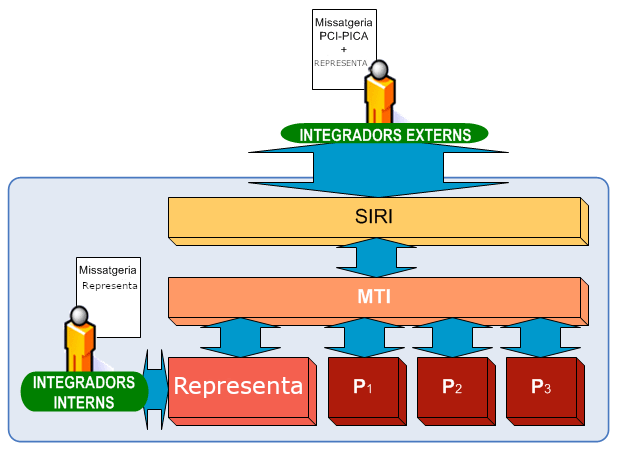

# 1. Introducció
A continuació es descriu el funcionament i les diferents modalitats de consum del servei de Representa.

## 1.1. Integració PCI
Tal i com es reflecteix a la següent figura, el **Core** de **Representa** s'integra dins de l'arquitectura de la Plataforma de Col·laboració Interadministrativa (en endavant PCI) a mode d'un nou servei accessible a través de la MTI.

Per tant els integradors que vulguin accedir al Core de Representa ho hauran de fer a través de la missatgeria de la PCI utilitzant l'element `<DatosEspecificos>` d'aquesta, per a més informació podeu consultar el document d'integració de la PCI [aqui](https://www.aoc.cat/knowledge-base/plataforma-de-col-laboracio-administrativa-2/idservei/enotum/)

<p align="center">

</p>  

# 2. Missatgeria
Com es comenta en el punt 1.1 d'aquest document, Representa funciona com a servei dins de la PCI, serà per tant necessari treballar amb la missatgeria de la PCI, encapsulant la missatgeria específica de Representa dins d'aquesta.

Específicament per a fer ús del servei de Representa dins de la missatgeria de la PCI és necessari informar els següents elements del missatge XML:

```
//Peticion/Atributos/CodigoProducto >> REPRESENTA
//Peticion/Atributos/CodigoCertificado >> REPRESENTA_VALIDACIO / REPRESENTA_CONSULTA / REPRESENTA_MODIFICACIO / REPRESENTA_ALTA _segons l'ús**_
//Peticion/Atributos/DatosAutorizacion/Finalidad >> PROVES (preproducció) / REPRESENTA (producció)
//Peticion/Solicitudes/SolicitudTransmision/DatosGenericos/Transmision/CodigoCertificado >> REPRESENTA_VALIDACIO / REPRESENTA_CONSULTA / REPRESENTA_MODIFICACIO / REPRESENTA_ALTA _segons l'ús**_
//Peticion/Solicitudes/SolicitudTransmision/DatosEspecíficos >> _Petició XML específica de Representa del tipus consultarRepresentacions, consultarRepresentacio o validarRepresentacio_
```

Pel que fa a la resta del missatge PCI, cal que aquest compleixi amb els requisits definits al document d'integració de la PCI [aqui](https://www.aoc.cat/knowledge-base/plataforma-de-col-laboracio-administrativa-2/idservei/enotum/)

** Modalitats de consum descrites a l'apartat [3.6]


# 3. Missatgeria específica
La missatgeria específica de Representa exposada a la PCI s'engloba al fitxer [dadesEspecifiques.xsd](dadesEspecifiques.xsd)


## 3.1 Representacio

```xml
<xs:complexType name="representacio">
	<xs:sequence>
		<xs:element name="identificadorLegal" type="xs:string" minOccurs="0"/>
		<xs:element name="tipusRepresentacio" type="tipusRepresentacio" minOccurs="0"/>
		<xs:element name="estat" type="estat" minOccurs="0"/>
		<xs:element name="poderdant" type="persona" minOccurs="1"/>
		<xs:element name="representant" type="persona" minOccurs="1"/>
		<xs:element name="ambitRepresentacio" type="ambitRepresentacio" minOccurs="0"/>
		<xs:element name="dataCreacio" type="xs:string" minOccurs="0"/>
		<xs:element name="dataIniciVigencia" type="xs:string" minOccurs="0"/>
		<xs:element name="dataFiVigencia" type="xs:string" minOccurs="0"/>
		<xs:element name="validacions" type="xs:int" minOccurs="0" nillable="true"/>
		<xs:element name="csvPoderNotarial" type="xs:string" minOccurs="0"/>
		<xs:element name="dataValidacioPoderNotarial" type="xs:string" minOccurs="0" />
		<xs:element name="refAlta" type="xs:string" minOccurs="0"/>
		<xs:element name="solicitant" type="solicitant" minOccurs="0" />
		<xs:element name="origen" type="origen" minOccurs="0" />
		<xs:element name="idRepresentacioA" type="xs:string" minOccurs="0" />
		<xs:element name="evidencies" minOccurs="0" >
			<xs:complexType>
				<xs:sequence>
					<xs:element name="evidencia" type="evidencia" maxOccurs="unbounded"/>
				</xs:sequence>
			</xs:complexType>
		</xs:element>
	</xs:sequence>
</xs:complexType>
```

|Camp | Descripció|
|---- | ----------|
|identificadorLegal | Identificador únic de la representació|
|tipusRepresentacio | Tipus de Representacio (TIPUS_A, TIPUS_B, TIPUS_C)|
|estat | Llistat d'element _estat_|
|poderdant | Persona (física o jurídica) que atorga el poder de representació|
|representant | Persona (física o jurídica) que rep el poder de representació|
|ambitRepresentacio | Element per definir l'ambit de la representació. Segons el _tipusRepresentacio_ s'inclou l'element _administracio_, _tramit_ i _capacitat_|
|dataCreacio | Data de creació de la representació|
|dataIniciVigencia | Data d'inici de vigència|
|dataFiVigencia | Data de fi de la vigència|
|validacions | Nombre de validacions realitzades sobre aquesta representació|
|csvPoderNotarial | CSV del poder notarial adjunt en la inscripció de la representació|
|dataValidacioPoderNotarial | Data en que s'ha validat el poder notarial|
|refAlta | Identificador per vincular les possibles N representacions a tramit creades en el mateix instant d'inscripció|
|solicitant | Persona i administració que van sol·licitar la creació de la representació|
|idRepresentacioA | Relacionat amb l'apartat _a través de_ ... |
|evidencies | Llistat d'elements _evidencia_|

## 3.2 Evidencia
Per cada acció realitzada sobre una representació es registra un element _evidencia_ on es recull informació relativa a qui, què i quan s'ha efectuat un canvi en la representació.

```xml
<xs:complexType name="evidencia">
	<xs:sequence>
		<xs:element name="dataCreacio" type="xs:string" minOccurs="0"/>
		<xs:element name="identificadorLegal" type="xs:string"/>
		<xs:element name="motiu" type="xs:string"  minOccurs="0"/>		
		<xs:element name="documentsEvidencia" minOccurs="0">
			<xs:complexType>
				<xs:sequence>
					<xs:element name="documentEvidencia" type="documentEvidencia" maxOccurs="unbounded"/>
				</xs:sequence>
			</xs:complexType>
		</xs:element>
		<xs:element name="solicitant" type="solicitant" minOccurs="0"/>
	</xs:sequence>
</xs:complexType>
```

|Camp | Descripció|
|---- | ----------|
|dataCreacio | Data de creació de l'evidencia|
|identificadorLegal | Identificador únic de la representació|
|motiu | Motiu del canvi|
|solicitant | Element del tipus _solicitant_|
|documentsEvidencia | Llistat d'elements _documentEvidencia_|

## 3.3 DocumentEvidencia
Cada document adjunt a una representació es vincula a un element _evidencia_. Els documents poden ser sol·licituds (paper escanejat en còpia autèntica amb la sol·licitud de l'acció a realitzar sobre la representació), poders (poder notarial) o altres.
```xml
<xs:complexType name="documentEvidencia">
        <xs:sequence>
            <xs:element name="uuid" type="xs:string" minOccurs="0"/>
            <xs:element name="tipusDocument" type="xs:string" minOccurs="0"/>
            <xs:element name="nomDocument" type="xs:string" minOccurs="0"/>
            <xs:element name="descripcio" type="xs:string" minOccurs="0"/>
            <xs:element name="tamany" type="xs:string" minOccurs="0"/>
            <xs:element name="tipusEncriptacio" type="tipusEncriptacio"  minOccurs="0"/>
            <xs:element name="resumCriptografic" type="xs:string"  minOccurs="0"/>
            <xs:element name="dataCreacio" type="xs:string" minOccurs="0"/>
        </xs:sequence>
</xs:complexType>
```

|Camp | Descripció|
|---- | ----------|
|tipusDocument | Tipus del document (sol·licitud, poder notarial, altes) |
|nomDocument | Nom del document|
|descripcio | Descripció del document|
|tamany | Tamany (bytes)|
|tipusEncriptacio | Algoritme de resum criptogràfic|
|resumCriptografic | Resum hash|
|dataCreacio | Data de creació|

## 3.4 Tipus de representacions					   
```xml
<xs:simpleType name="tipusRepresentacio">
        <xs:restriction base="xs:string">
            <xs:enumeration value="TIPUS_A"/>
            <xs:enumeration value="TIPUS_B"/>
            <xs:enumeration value="TIPUS_C"/>
        </xs:restriction>
</xs:simpleType>
```
El tipus de representació té afectació en l'ambit de la representació
```xml
<xs:complexType name="ambitRepresentacio">
        <xs:sequence>
            <xs:element name="administracio" type="administracio" minOccurs="0"/>
            <xs:element name="tramit" minOccurs="0"  type="tramit"/>
            <xs:element name="capacitats" minOccurs="0" >
                <xs:complexType>
                    <xs:sequence>
                        <xs:element name="capacitat" type="capacitat" maxOccurs="unbounded"/>
                    </xs:sequence>
                </xs:complexType>
            </xs:element>
        </xs:sequence>
</xs:complexType>
```

L'element _tramit_ té la següent estructura:
```xml
<xs:complexType name="tramit">
    <xs:sequence>
        <xs:element type="xs:string" name="uuid" minOccurs="0" />
        <xs:element type="NonEmptyString" name="codi" minOccurs="0" />
        <xs:element type="NonEmptyString" name="nom" minOccurs="0" />
        <xs:element type="xs:string" name="uuidFamilia" minOccurs="0" />
        <xs:element type="xs:string" name="descripcio" minOccurs="0" />
        <xs:element type="xs:boolean" name="actiu" minOccurs="0" />
    </xs:sequence>
</xs:complexType>
```

|Camp | Descripció|
|---- | ----------|
|codi | Codi del tramit |
|nom | Nom del tramit |
|uuidFamilia | Identificador únic intern de la familia a la que pertany |
|descripcio | Descrpicó del tramit |
|actiu | Indicador d'actiu o no actiu |


### 3.4.1 General
Representació per a qualsevol tràmit, per a qualsevol administració.
Per aquest tipus de representació l'element _tipusRepresentacio_ té el valor **TIPUS_A**.

L'element _ambitRepresentació_ està buit ja que no aplica.

Exemple:
```xml
<representacio>
   <identificadorLegal>201900000096</identificadorLegal>
   <tipusRepresentacio>TIPUS_A</tipusRepresentacio>
   <estat>VALIDA</estat>
   <poderdant>
      ...
   </poderdant>
   <representant>
      ...
   </representant>
   <ambitRepresentacio/>
   <dataCreacio>2019-03-07T00:00:00</dataCreacio>
   <dataIniciVigencia>2019-03-06T00:00:00</dataIniciVigencia>
   <dataFiVigencia>2019-03-07T00:00:00</dataFiVigencia>
   <validacions>0</validacions>
   <solicitant>
      ...
   </solicitant>
   <evidencies>
      <evidencia>
          ...
      </evidencia>
   </evidencies>
</representacio>
```

### 3.4.2 A organisme
Representació per a qualsevol tràmit, per a una administració concreta.
Per aquest tipus de representació l'element _tipusRepresentacio_ té el valor **TIPUS_B**.

L'element _ambitRepresentació_ té definit l'element _administracio_.

Exemple:
```xml
<representacio>
   <identificadorLegal>201900000097</identificadorLegal>
   <tipusRepresentacio>TIPUS_A</tipusRepresentacio>
   <estat>VALIDA</estat>
   <poderdant>
      ...
   </poderdant>
   <representant>
      ...
   </representant>
   <ambitRepresentacio>
      <administracio>
	        ...
      </administracio>
   </ambitRepresentacio>
   <dataCreacio>2019-03-07T00:00:00</dataCreacio>
   <dataIniciVigencia>2019-03-06T00:00:00</dataIniciVigencia>
   <dataFiVigencia>2019-03-07T00:00:00</dataFiVigencia>
   <validacions>0</validacions>
   <solicitant>
      ...
   </solicitant>
   <evidencies>
      <evidencia>
          ...
      </evidencia>
   </evidencies>
</representacio>
```

### 3.4.3 A tramit
Representació per a una administració concreta i per a un tramit concret.
Per aquest tipus de representació l'element _tipusRepresentacio_ té el valor **TIPUS_C**.

L'element _ambitRepresentació_ té definida la _administracio_, l'element _tramit_ i una llista d'elements _capacitat_.

Exemple:
```xml
<representacio>
   <identificadorLegal>201900000098</identificadorLegal>
   <tipusRepresentacio>TIPUS_C</tipusRepresentacio>
   <estat>VALIDA</estat>
   <poderdant>
      ...
   </poderdant>
   <representant>
      ...
   </representant>
   <ambitRepresentacio>
      <administracio>
	        ...
      </administracio>
      <tramit>
         ...
      </tramit>
      <capacitats>
         <capacitat>
            ...
         </capacitat>
      </capacitats>
   </ambitRepresentacio>
   <dataCreacio>2019-03-07T00:00:00</dataCreacio>
   <dataIniciVigencia>2019-03-06T00:00:00</dataIniciVigencia>
   <dataFiVigencia>2019-03-07T00:00:00</dataFiVigencia>
   <validacions>0</validacions>
   <solicitant>
      ...
   </solicitant>
   <evidencies>
      <evidencia>
          ...
      </evidencia>
   </evidencies>
</representacio>
```

## 3.5 Estats
Estats possibles d'una representació:
* VALIDA >> Representació vàlida. L'únic estat d'una representació per a que en una consulta de validació sigui utilitzada.
* PENDENT_VALIDACIO >> S'ha aportat documentació que cal revisar i validar per poder canviar l'estat a VALIDA o DENEGADA. Quan es faci una consulta de _Validacio_ una representació en aquest estat no podrà ser usada per respondre afirmativament.
* DENEGADA >> Un cop revisada la documentació adjunta a la inscripció.
* EXPIRADA >> Una representació que abans ha estat VALIDA o PENDENT_VALIDACIO, però en la data actual està fora del seu periode de vigència.
* RENUNCIADA >> El representant renuncia a la representació.
* REVOCADA >> El poderdant revoca la representació.
* ANULADA >> Estat excepcional en que per un motiu un funcionari habilitat invalida una representació.

### 3.5.1 Diagrama de fluxe d'estats
_Pendent_


## 3.6 Operacions

### 3.6.1 Consulta de representacions
Permet consultar les representacions existents entre dues persones. 
Cal indicar a l'atribut _CodigoCertificado_ de la petició de la PCI *REPRESENTA_CONSULTA_REPRESENTACIONS*.

#### Peticio
```xml
<xs:element name="consultarRepresentacions">
        <xs:complexType>
            <xs:sequence>
                <xs:element name="ConsultaRepresentacions">
                    <xs:complexType>
                        <xs:sequence>
                            <xs:element name="mida" type="mida"/>
                            <xs:element name="pagina" type="pagina"/>
                            <xs:element name="representacio" type="representacio"/>
                            <xs:element name="estats" minOccurs="0">
                                <xs:complexType>
                                    <xs:sequence>
                                        <xs:element name="estat"  type="estat" minOccurs="0" maxOccurs="unbounded"/>
                                    </xs:sequence>
                                </xs:complexType>
                            </xs:element>
							<xs:element name="generaInforme" type="xs:boolean" minOccurs="0"/>
							<xs:element name="solicitant" type="solicitant" />	
                        </xs:sequence>
                    </xs:complexType>
                </xs:element>
            </xs:sequence>
        </xs:complexType>
    </xs:element>
```
Segons el tipus de representació que es desitgi consultar, per a l'element _representacio_ serà obligatori informat determinats camps. Alguns camp es controlen mitjançant validació contra l'esquema xsd i d'altres es comproven a nivell d'aplicació segons el cas d'ús.


Camp | Descripció
---- | ----------
mida | Nombre màxim de resultats retornats per pàgina
pagina | Pàgina de resultats sol·licitada (de 0 a N)
representacio | Element _representacio_ on es poden definir alguns atributs per cercar i filtrar les representacions
estats | Llistat d'1 o més elements _estat_ usats per filtrar els resultats
generaInforme | Camp opcional boolea per indicar si es vol generar un informe PDF amb el resultat de la cerca. Es retorna una url de descàrrega.
solicitant | Persona i administració que sol·licita la petició

#### Resposta

```xml
<xs:element name="consultarRepresentacionsResponse">
	<xs:complexType>
		<xs:sequence>
			<xs:element name="resultat">
				<xs:complexType>
					<xs:sequence>
						<xs:element name="resposta"  type="resposta"/>
						<xs:element name="numRepresentacionsTotal"/>
						<xs:element name="numPaginesTotal"/>
						<xs:element name="representacions" minOccurs="0">
							<xs:complexType>
								<xs:sequence>
									<xs:element name="representacio"  type="representacio" minOccurs="0" maxOccurs="unbounded"/>
								</xs:sequence>
							</xs:complexType>
						</xs:element>
						<xs:element name="urlDescarregaInforme"  minOccurs="0"/>
					</xs:sequence>
				</xs:complexType>
			</xs:element>
		</xs:sequence>
	</xs:complexType>
</xs:element>
```

Camp | Descripció
---- | ----------
resposta | Element del tipus _resposta_
numRepresentacionsTotal | Nombre de representacions totals resultants de la petició de consulta
numPaginesTotal | Nombre de pàgines totals dels resultats de la petició de consulta
representacions | Llistat d'1 o més elements del tipus [_representacio_](#21-representacio)
urlDescarregaInforme | Camp opcional on es retorna una url per poder descarregar l'informe sol·licitat a la petició

### 3.6.2 Consulta de representació
Permet recuperar *una* representació a partir del seu identificador únic (identificadorLegal).
Cal indicar a l'atribut _CodigoCertificado_ de la petició de la PCI *REPRESENTA_CONSULTA_REPRESENTACIO*.

### Petició

```xml
<xs:element name="consultarRepresentacio">
	<xs:complexType>
        <xs:sequence>
            <xs:element name="ConsultaRepresentacio">
                <xs:complexType>
                    <xs:sequence>
                        <xs:element name="identificadorLegal" type="xs:string" />
						<xs:element name="generaInforme" type="xs:boolean" minOccurs="0"/>
                        <xs:element name="solicitant" type="solicitant" />
                    </xs:sequence>
                </xs:complexType>
            </xs:element>
        </xs:sequence>
    </xs:complexType>
</xs:element>
```

Camp | Descripció
---- | ----------
identificadorLegal | Identificador únic de la representació
generaInforme | Camp opcional boolea per indicar si es vol generar un informe PDF amb el resultat de la cerca. Es retorna una url de descàrrega.
solicitant | Persona i administració que sol·licita la petició

### Resposta

```xml
<xs:element name="consultarRepresentacioResponse">
	<xs:complexType>
		<xs:sequence>
			<xs:element name="resultat">
				<xs:complexType>
					<xs:sequence>
						<xs:element name="resposta" type="resposta" />
						<xs:element name="representacio" type="representacio" minOccurs="0" />
						<xs:element name="urlDescarregaInforme"  minOccurs="0"/>
					</xs:sequence>
				</xs:complexType>
			</xs:element>
		</xs:sequence>
	</xs:complexType>
</xs:element>
```

Camp | Descripció
---- | ----------
resposta | Identificador únic de la representació
representacio | Element del tipus [_representació_](#21-representacio)
urlDescarregaInforme | Camp opcional on es retorna una url per poder descarregar l'informe sol·licitat a la petició

### 3.6.3 Validació
La opertació de validació permet preguntar a Representa si existeix alguna representació en estat _VALIDA_ entre un poderdant i un representant per un tràmit i capacitat específic.
En cas d'existir alguna representació existent i vàlida que ho permeti es respon afirmativament i es retorna el detall de la representació emprada per donar aquesta resposta.
Cal indicar a l'atribut _CodigoCertificado_ de la petició de la PCI *REPRESENTA_VALIDACIO*.

#### Petició

```xml
<xs:element name="validarRepresentacio">
        <xs:complexType>
            <xs:sequence>
                <xs:element name="representacio" type="representacio" minOccurs="0"/>
                <xs:element name="dataValidacio" type="xs:string"/>
                <xs:element name="solicitant" type="solicitant" />
            </xs:sequence>
        </xs:complexType>
</xs:element>
```

Camp | Descripció
---- | ----------
representacio | Element del tipus _representacio_ on incloure la informació relativa a la consulta de validació (poderdant, representant, tramit, capacitat/s)
dataValidacio | Data on es fa la consulta de validació. Aquesta data ha d'estar compresa entre la _dataIniciVigencia_ i la _dataFiVigencia_ de la representació recuperada pel servei
solicitant | Persona i administració que sol·licita la petició

#### Resposta

```xml
<xs:element name="validarRepresentacioResponse">
        <xs:complexType>
            <xs:sequence>
                <xs:element name="resultat">
                    <xs:complexType>
                        <xs:sequence>
                            <xs:element name="resposta"  type="resposta"/>
                            <xs:element name="representacio" type="representacio"/>
                        </xs:sequence>
                    </xs:complexType>
                </xs:element>
            </xs:sequence>
        </xs:complexType>
</xs:element>
```

Camp | Descripció
---- | ----------
resposta | Element del tipus _resposta_
representacio | Element del tipus _representacio_ on es retorna el detall de la representació vàlida que permet respondre afirmativament a la consulta de validació

S'inclou l'element _resposta_

```xml
<xs:complexType name="resposta">
        <xs:sequence>
            <xs:element type="xs:string" name="codi" minOccurs="0"/>
            <xs:element type="xs:string" name="descripcio" minOccurs="0"/>
            <xs:element type="xs:string" name="tipusSolicitud" minOccurs="0"/>
        </xs:sequence>
</xs:complexType>
```

Camp | Descripció
---- | ----------
codi | Codi del resultat de la petició
descripcio | Descripció del resultat de la petició
tipusSolicitud | Tipus de sol·licitud de la petició

### 3.6.4 Alta / Modificació
Permet realitzar la inscripció o modificació** d'una representació.
La modificació només permet modificar l'estat d'una representació. Cap dels atributs de la representació poden ser modificats un cop creada una representació.

#### Petició

```xml
<xs:element name="processarRepresentacio">
	<xs:complexType>
		<xs:sequence>
			<xs:element name="dades">
				<xs:complexType>
					<xs:sequence>
						<xs:element name="tokenValid" type="xs:string" minOccurs="0" />
						<xs:element name="representacio" type="representacio">
						</xs:element>
						<xs:element name="documentsRepresentacio" minOccurs="0" >
							<xs:complexType>
								<xs:sequence>
									<xs:element name="documentRepresentacio" minOccurs="0" maxOccurs="unbounded" type="documentRepresentacio" />
								</xs:sequence>
							</xs:complexType>
						</xs:element>
						<xs:element name="motiu" type="xs:string" />
						<xs:element name="tipusSolicitud"  type="tipusSolicitud"/>				
						<xs:element name="solicitant" type="solicitant" />
					</xs:sequence>
				</xs:complexType>
			</xs:element>
		</xs:sequence>
	</xs:complexType>
</xs:element>
```

Camp | Descripció
---- | ----------
tokenValid | Token d'autenticació proporcionat per el servei VALID per a poder recuperar les evidències i adjuntar-les a la representació
representacio | Element del tipus _representacio_ 
documentsRepresentacio | Elements del tipus _documentRepresentacio_
motiu | Descripció del motiu de la inscripció
tipusSolicitud | Tipus de sol·licitud de la petició (ALTA, MODIFICACIO)
solicitant | Persona i administració que sol·licita la petició


#### Resposta
```xml
<xs:element name="processarRepresentacioResponse">
	<xs:complexType>
		<xs:sequence>
			<xs:element name="resultat" minOccurs="0">
				<xs:complexType>
					<xs:sequence>
						<xs:element name="resposta" type="resposta" />
						<xs:element name="representacio" type="representacio" />
					</xs:sequence>
				</xs:complexType>
			</xs:element>
		</xs:sequence>
	</xs:complexType>
</xs:element>
```

Camp | Descripció
---- | ----------
resposta | Element del tipus _resposta_
representacio | Element del tipus _representacio_ on es retorna el detall de la representació vàlida que permet respondre afirmativament a la consulta de validació


## 3.7 Elements missatgeria

### 3.7.1 Capacitat
Indica quin tipus d'accions defineixen l'ambit d'una representació per a les representacions de tipus _a tramit_.
Les representacions _a organisme_ o _generals_ no tenen la dimensió de capacitat.

```
<xs:complexType name="capacitat">
	<xs:sequence>
		<xs:element name="codi" type="xs:string"/>
		<xs:element name="nom" type="xs:string" minOccurs="0"/>
	</xs:sequence>
</xs:complexType>
```

La capacitat pot tenir els següents _codi_:
- CONSULTAR
- TRAMITAR
- NOTIFICAR

#### 3.7.2 Solicitant
Element obligatori on cal informar quina persona i des de quina administració es fa la petició. Adicionalment a les consultes, els elements _representacio_ conserven la informació del _solicitant_ que va sol·licitar-ne la creació.

```xml
<xs:complexType name="solicitant">
	<xs:sequence>
		<xs:element name="persona" type="persona" minOccurs="0" />
		<xs:element name="administracio" type="administracio" minOccurs="0" />
	</xs:sequence>
</xs:complexType>
```

#### 3.7.3 Origen
Camp on es desa la font des d'on es va crear una representació. Pot pendre els següents valors:

```xml
<xs:simpleType name="origen">
	<xs:restriction base="xs:string">
		<xs:enumeration value="PORTAL_EMPLEAT"/>
		<xs:enumeration value="PORTAL_CIUTADA"/>
		<xs:enumeration value="INTEGRACIO"/>
	</xs:restriction>
</xs:simpleType>
```

# 4. Exemples de peticions

## 4.1 Consulta

### Petició

```xml
<consultarRepresentacio>
	<ConsultaRepresentacio>            
		<identificadorLegal>201900000063</identificadorLegal>
		<solicitant>
			<persona>
				 <tipusDocumentIdentificatiu>NIF</tipusDocumentIdentificatiu>
				<tipusPersona>FISICA</tipusPersona>
				<valorDocumentIdentificatiu>12121212Z</valorDocumentIdentificatiu>
			</persona>
			<administracio>
				<codi>9821920002</codi>
			</administracio>
		</solicitant>
	</ConsultaRepresentacio>
</consultarRepresentacio>
```

Si es vol retornar els resultats en format PDF generant un informe cal indicar l'element _generaInforme_ a _true_.

### Resposta de consulta de representació

```xml
<consultarRepresentacioResponse xmlns="http://www.aoc.cat/representa/v2">
	 <resultat>
		<resposta>
		   <codi>0</codi>
		   <descripcio>L'operació ha estat executada correctament</descripcio>
		   <tipusSolicitud>CONSULTA</tipusSolicitud>
		</resposta>
		<representacio>
		   <identificadorLegal>201900000063</identificadorLegal>
		   <tipusRepresentacio>TIPUS_C</tipusRepresentacio>
		   <estat>EXPIRADA</estat>
		   <poderdant>
			  ...
		   </poderdant>
		   <representant>
			  ...
		   </representant>
		   <ambitRepresentacio>
			  <administracio>
				 ...
			  </administracio>
			  <tramit>
				 ...
			  </tramit>
			  <capacitats>
				 ...
			  </capacitats>
		   </ambitRepresentacio>
		   <dataCreacio>2019-02-24T00:00:00</dataCreacio>
		   <dataIniciVigencia>2019-02-23T00:00:00</dataIniciVigencia>
		   <dataFiVigencia>2019-02-24T00:00:00</dataFiVigencia>
		   <validacions>0</validacions>
		   <solicitant>
			  ...
		   </solicitant>
		   <refAlta>a716be0b-4882-44a2-bd4a-7de30bbc8a8b-2512070005</refAlta>
		   <evidencies>
			  <evidencia>
				 ...
			  </evidencia>
			  <evidencia>
				 ...
			  </evidencia>
		   </evidencies>
		</representacio>
	</resultat>
 </consultarRepresentacioResponse>
```

Si la consulta anterior inclou l'element _generaInforme_ amb valor _true_ es retorna una resposta tipus:

```xml
<consultarRepresentacioResponse xmlns="http://www.aoc.cat/representa/v2">
	<resultat>
	<resposta>
	   <codi>0</codi>
	   <descripcio>L'operació ha estat executada correctament</descripcio>
	   <tipusSolicitud>CONSULTA</tipusSolicitud>
	</resposta>
	<urlDescarregaInforme xsi:type="xsd:string" xmlns:xsd="http://www.w3.org/2001/XMLSchema" xmlns:xsi="http://www.w3.org/2001/XMLSchema-instance">http://serveis3.app.aoc.cat/representa-core/informe?uuid=bea705e1-6669-4550-b59a-7da0bb99a16c</urlDescarregaInforme>
	</resultat>
</consultarRepresentacioResponse>
```

## 4.2 Consulta (múltiples representacions)
Exemple on es consulten les primeres 25 representacions en estat VALIDA o EXPIRADA existents entre el NIF 11223344B i el NIF 12345678Z

### Petició

```xml
<consultarRepresentacions>
	<ConsultaRepresentacions>
		<mida>25</mida>
		<pagina>0</pagina>
		<representacio>			
			<poderdant>
					 <tipusDocumentIdentificatiu>NIF</tipusDocumentIdentificatiu>
					 <valorDocumentIdentificatiu>11223344B</valorDocumentIdentificatiu> 
					 <tipusPersona>FISICA</tipusPersona>
			</poderdant>
			<representant>
					 <tipusDocumentIdentificatiu>NIF</tipusDocumentIdentificatiu>
					 <valorDocumentIdentificatiu>12345678Z</valorDocumentIdentificatiu>
					 <tipusPersona>FISICA</tipusPersona>
				  </representant>             	
		</representacio>      					 
		<estats>		 
		   <estat>VALIDA</estat>
		   <estat>EXPIRADA</estat>
		</estats>         
		<generaInforme>false</generaInforme>		
		<solicitant>
			<persona>
				 <tipusDocumentIdentificatiu>NIF</tipusDocumentIdentificatiu>
				<tipusPersona>FISICA</tipusPersona>
				<valorDocumentIdentificatiu>12121212Z</valorDocumentIdentificatiu>
			</persona>
			<administracio>
				<codi>9821920002</codi>
			</administracio>
		</solicitant> 
	</ConsultaRepresentacions>
</consultarRepresentacions>
```

Si es vol retornar els resultats en format PDF generant un informe cal indicar l'element _generaInforme_ a _true_.


### Resposta

La resposta indica que la consulta anterior consta de 53 representacions i 6 pàgines de resultats.

```xml
<consultarRepresentacionsResponse xmlns="http://www.aoc.cat/representa/v2">
	<resultat>
		<resposta>
		   <codi>0</codi>
		   <descripcio>L'operació ha estat executada correctament</descripcio>
		   <tipusSolicitud>CONSULTA</tipusSolicitud>
		</resposta>
		<numRepresentacionsTotal xsi:type="xsd:int" xmlns:xsd="http://www.w3.org/2001/XMLSchema" xmlns:xsi="http://www.w3.org/2001/XMLSchema-instance">53</numRepresentacionsTotal>
		<numPaginesTotal xsi:type="xsd:int" xmlns:xsd="http://www.w3.org/2001/XMLSchema" xmlns:xsi="http://www.w3.org/2001/XMLSchema-instance">6</numPaginesTotal>
		<representacions>
		   <representacio>
			  ...
		   </representacio>
		   <representacio>
			  ...
		   </representacio>
		</representacions>
	</resultat>
</consultarRepresentacionsResponse>
```

Si la consulta anterior inclou l'element _generaInforme_ amb valor _true_ es retorna una resposta tipus:

```xml
<consultarRepresentacionsResponse xmlns="http://www.aoc.cat/representa/v2">
	<resultat>
		<resposta>
		   <codi>0</codi>
		   <descripcio>L'operació ha estat executada correctament</descripcio>
		   <tipusSolicitud>INFORME</tipusSolicitud>
		</resposta>
		<urlDescarregaInforme xsi:type="xsd:string" xmlns:xsd="http://www.w3.org/2001/XMLSchema" xmlns:xsi="http://www.w3.org/2001/XMLSchema-instance">http://serveis3.app.aoc.cat/representa-core/informe?uuid=d94e19f3-9f49-4819-9356-9f6c93c18c8b</urlDescarregaInforme>
	</resultat>
</consultarRepresentacionsResponse>
```

NOTA: _L'informe retorna el nombre d'elements i pàgina indicats a la consulta. En cas de necessitar generar informes amb més de 25 elements per pàgina, poseu-vos en contacte amb el CAU de l'AOC i revisarem el cas._

## 4.3 Validació
En aquest exemple es pregunta si existeix alguna representació vàlida perquè el representant amb NIF 99999999A pugui actuar (en aquest cas amb la capacitat de CONSULTA) en nom del poderdant amb NIF 12345678Z per al tramit amb codi 1111 a l'administració amb codi 800180001.

### Peticio

```xml
<validarRepresentacio xmlns="http://www.aoc.cat/representa/v2">
		<representacio>
			<poderdant>
				<tipusDocumentIdentificatiu>NIF</tipusDocumentIdentificatiu>
				<valorDocumentIdentificatiu>12345678Z</valorDocumentIdentificatiu>
				<tipusPersona>FISICA</tipusPersona>
			</poderdant>
			<representant>
				<tipusDocumentIdentificatiu>NIF</tipusDocumentIdentificatiu>
				<valorDocumentIdentificatiu>99999999A</valorDocumentIdentificatiu>
				<tipusPersona>FISICA</tipusPersona>
			</representant>
			<ambitRepresentacio>
				<administracio>
					<codi>800180001</codi>
				</administracio>
				<tramit>					
					<codi>1111</codi>
				</tramit>
				<capacitats>
					<capacitat>
						<codi>CONSULTA</codi>
					</capacitat>
				</capacitats>
			</ambitRepresentacio>
		</representacio>
		<dataValidacio>2019-03-07T00:00:00</dataValidacio>
		<solicitant>
	        <persona>
	         	<tipusDocumentIdentificatiu>NIF</tipusDocumentIdentificatiu>
				<tipusPersona>FISICA</tipusPersona>
	         	<valorDocumentIdentificatiu>12345678A</valorDocumentIdentificatiu>
	        </persona>
	        <administracio>
	         	<codi>12345</codi>
	        </administracio>
         </solicitant>
</validarRepresentacio>
```

### Resposta (validació positiva)
Si existeix una representació** que permet al representant actuar en nom del poderdant per aquest tramit, administració i capacitat, es retorna una resposta tipus:

```xml
<validarRepresentacioResponse xmlns="http://www.aoc.cat/representa/v2">
 <resultat>
	<resposta>
	   <codi>0</codi>
	   <descripcio>S'ha validat positivament el poder sol·licitat</descripcio>
	   <tipusSolicitud>VALIDACIO</tipusSolicitud>
	</resposta>
	<representacio>
	   <identificadorLegal>201900000131</identificadorLegal>
	   <tipusRepresentacio>TIPUS_B</tipusRepresentacio>
	   <estat>VALIDA</estat>
	   <poderdant>
		  ...
	   </poderdant>
	   <representant>
		  ...
	   </representant>
	   <ambitRepresentacio>
		  <administracio>
			 <codi>800180001</codi>
			 <nif>P-0800100-J</nif>
			 <nom>Ajuntament d'Abrera</nom>
			 <activa>true</activa>
		  </administracio>
	   </ambitRepresentacio>
	   <dataCreacio>2019-03-08T00:00:00</dataCreacio>
	   <dataIniciVigencia>2019-03-05T00:00:00</dataIniciVigencia>
	   <dataFiVigencia>2019-03-08T00:00:00</dataFiVigencia>
	   <validacions>2</validacions>
	   <solicitant>
		  ...
	   </solicitant>
	   <evidencies>
		  <evidencia>
			 <dataCreacio>2019-03-05T14:18:01</dataCreacio>
			 <identificadorLegal>201900000131</identificadorLegal>
			 <motiu>ALTA - Inscripció</motiu>
			 <solicitant>
				...
			 </solicitant>
			 <funcionariReceptor>
				...
			 </funcionariReceptor>
			 <documentsEvidencia>
				<documentEvidencia>
				   ...
				</documentEvidencia>
			 </documentsEvidencia>
		  </evidencia>
	   </evidencies>
	</representacio>
 </resultat>
</validarRepresentacioResponse>
```

** _Només pot existir una representació vàlida que doni resposta positiva a una consulta de validació._

### Resposta (validacio negativa)
En cas que no existeixi cap representació que permeti respondre positivament a la consulta de validació, es retorna una resposta del tipus:

```xml
<validarRepresentacioResponse xmlns="http://www.aoc.cat/representa/v2">
	<resultat>
        <resposta>
            <codi>001</codi>
            <descripcio>No hi ha cap apoderament inscrit amb aquesta informació</descripcio>
        </resposta>
    </resultat>
</validarRepresentacioResponse>
```

## 4.4 Alta
Exemple on es crea una representació.

### Petició

```xml
<processarRepresentacio xmlns="http://www.aoc.cat/representa/v2">
	<dades>
		<tokenValid>3Khny65kn....</tokenValid>				   
		<representacio>    			
			<tipusRepresentacio>TIPUS_A</tipusRepresentacio>
			<poderdant>
				<tipusDocumentIdentificatiu>NIF</tipusDocumentIdentificatiu>
				<valorDocumentIdentificatiu>11223344B</valorDocumentIdentificatiu>
				<tipusPersona>FISICA</tipusPersona>
			</poderdant> 
			<representant>
				<tipusDocumentIdentificatiu>NIF</tipusDocumentIdentificatiu>
				<valorDocumentIdentificatiu>12121212Z</valorDocumentIdentificatiu>
				<tipusPersona>FISICA</tipusPersona>
			</representant>        
			<estat>VALIDA</estat>  
			<dataIniciVigencia>2019-11-26T00:00:00</dataIniciVigencia>
			<dataFiVigencia>2024-11-26T00:00:00</dataFiVigencia>	                                             
		</representacio>
		<motiu>Alta de representacio</motiu>
		<tipusSolicitud>ALTA</tipusSolicitud>				
		<solicitant>
			<persona>
				<tipusDocumentIdentificatiu>NIF</tipusDocumentIdentificatiu>
				<tipusPersona>FISICA</tipusPersona>
				<valorDocumentIdentificatiu>00000000A</valorDocumentIdentificatiu>
			</persona>
			<administracio>
				<codi>12345</codi>
			</administracio>
		</solicitant> 
	</dades>
</processarRepresentacio>
```

### Resposta

```xml
 <processarRepresentacioResponse xmlns:ns2="http://www.aoc.cat/representa/v2">
	<resultat>
	   <resposta>
		  <codi>0</codi>
		  <descripcio>L'operació ha estat executada correctament</descripcio>
		  <tipusSolicitud>ALTA</tipusSolicitud>
	   </resposta>
	   <representacio>
		  <identificadorLegal>201900000426</identificadorLegal>
		  <tipusRepresentacio>TIPUS_A</tipusRepresentacio>
		  <estat>VALIDA</estat>
		  <poderdant>
			 ...
		  </poderdant>
		  <representant>
			 ...
		  </representant>
		  <ambitRepresentacio/>
		  <dataCreacio>2019-10-11T14:42:51</dataCreacio>
		  <dataIniciVigencia>2019-11-26T00:00:00</dataIniciVigencia>
		  <dataFiVigencia>2019-11-27T00:00:00</dataFiVigencia>
		  <validacions>0</validacions>
		  <solicitant>
			...
		  </solicitant>
		  <evidencies>
			 <evidencia>
				<dataCreacio>2019-10-11T14:42:51</dataCreacio>
				<identificadorLegal>201900000426</identificadorLegal>
				<estat>VALIDA</estat>
				<motiu>Alta de representacio</motiu>                        
				<solicitant>
					...
				</solicitant>
			 </evidencia>
		  </evidencies>
	   </representacio>
	</resultat>
 </processarRepresentacioResponse>
```

## 4.5 Modificació
L'unic atribut que es pot modificar d'una representació és el seu _estat_. Per a fer-ho cal indicar l'identificadorLegal per recuperar la representació i el nou estat que es desitja modificar.
En aquest exemple es modifica l'estat de la representació creada al punt 4.7 passant de VALIDA a DENEGADA.

### Petició

```xml
<processarRepresentacio xmlns="http://www.aoc.cat/representa/v2">
	<dades>
		<tokenValid/>				   
		<representacio>   
			<identificadorLegal>201900000426</identificadorLegal>       
			<estat>DENEGADA</estat>
			<administracioReceptora>
				<codi>1234</codi>
			</administracioReceptora>                                       
		</representacio>
		<motiu>Denegació de la representació</motiu>
		<tipusSolicitud>MODIFICACIO</tipusSolicitud>				
		<solicitant>
			<persona>
				<tipusDocumentIdentificatiu>NIF</tipusDocumentIdentificatiu>
				<tipusPersona>FISICA</tipusPersona>
				<valorDocumentIdentificatiu>00000000A</valorDocumentIdentificatiu>         
			</persona>
			<administracio>
				<codi>1234</codi>
			</administracio>
		</solicitant> 
	</dades>
</processarRepresentacio>
```

### Resposta

```xml
<processarRepresentacioResponse xmlns:ns2="http://www.aoc.cat/representa/v2">
	<resultat>
	   <resposta>
		  <codi>0</codi>
		  <descripcio>L'operació ha estat executada correctament</descripcio>
		  <tipusSolicitud>MODIFICACIO</tipusSolicitud>
	   </resposta>
	   <representacio>
		  <identificadorLegal>201900000426</identificadorLegal>
		  <tipusRepresentacio>TIPUS_A</tipusRepresentacio>
		  <estat>DENEGADA</estat>
		  <poderdant>
			 ...
		  </poderdant>
		  <representant>
			 ...
		  </representant>
		  <ambitRepresentacio/>
		  <dataCreacio>2019-10-11T14:42:51</dataCreacio>
		  <dataIniciVigencia>2019-11-26T00:00:00</dataIniciVigencia>
		  <dataFiVigencia>2019-11-27T00:00:00</dataFiVigencia>
		  <validacions>0</validacions>
		  <solicitant>
			 ...
		  </solicitant>
		  <evidencies>
			 <evidencia>
				<dataCreacio>2019-10-11T14:42:51</dataCreacio>
				<identificadorLegal>201900000426</identificadorLegal>
				<estat>VALIDA</estat>
				<motiu>ALTA - Alta a través de PCI3</motiu>
				<solicitant>
					 ...
				</solicitant>				
				<documentsEvidencia>
				   <documentEvidencia>
					  <uuid>117095</uuid>
					  <nomDocument>SIGNATURA_EVIDENCIA_136091.xml</nomDocument>
					  <descripcio>Signatura creada automaticament</descripcio>
					  <dataCreacio>2019-10-11T14:45:21</dataCreacio>
				   </documentEvidencia>
				</documentsEvidencia>
			 </evidencia>
			 <evidencia>
				<dataCreacio>2019-10-11T15:00:15</dataCreacio>
				<identificadorLegal>201900000426</identificadorLegal>
				<estat>DENEGADA</estat>
				<motiu>MODIFICACIO - Denegació de la representació</motiu>
				<solicitant>
					 ...
				</solicitant>
			 </evidencia>
		  </evidencies>
	   </representacio>
	</resultat>
</processarRepresentacioResponse>
```

# 5. Codis de resposta
_Pendent_

# 6. Cataleg de tràmits
Els tràmits als que es poden crear representacions o indicar a les consultes de validació s'agrupen en *families*. Alhora les families s'agrupen entorn a una entitat anomenada *cataleg*.
Una administració només pot tenir associat 1 únic catàleg, ja sigui _propi_ o _d'ús compartit_.
Per generar o fer ús del catàleg es contemplen 3 escenaris:

## 6.1 Creació manual
Quan una administració inicia l'ús del servei de Representa disposarà d'un catàleg inicial buit, on podrà anar creant families i associar-hi tràmits d'una manera manual i individual segons necessiti.

## 6.2 Importació mitjançant fitxer CSV
Per aquelles administracions que disposin d'un catàleg propi s'ofereix la possibilitat de carregar-lo a través de fitxers en format CSV. Aquest procés requereix 2 fitxers:

* CSV per families > cal adjuntar un fitxer .csv amb les families amb el format _"Codi familia";"Nom familia"_

Exemple:
```
"0004";"Llicències"
"0006";"Ajudes"
"0007";"Sol·licituds"
```

El codi de cada familia ha de ser únic per cada catàleg.

* CSV per tramits > cal adjuntar un fitxer .csv amb els tràmits amb el format _"Codi familia;"Codi tràmit";"Nom tramit"_

Exemple:
```
"0004";"1110";"Llicència d'obres"
"0004";"1230";"Reclamacions i recursos a taxes i preus públics"
"0006";"1456";"Plans parcials d'ordenació"
```
El codi de cada tràmit ha de ser únic per cada familia. És recomenable que també sigui únic en tot el catàleg.

Restriccions / limitacions
* El separador de columnes del fitxer csv ha de ser el caràcter ';'.
* Un catàleg pot incloure N families.
* Una familia pot incloure N tràmits.
* Tot tràmit ha de pertànyer a una familia i ha d'estar vinculat a una familia existent (o bé s'ha creat en una càrrega anterior o està definit en el fitxer families.csv que acompanyi la càrrega del tramits.csv en qüestió).
* La càrrega mitjançant csv no actualitzarà cap familia ni cap tràmit existent. Un cop s'hagi creat una familia o tràmit amb un codi determinat, les posteriors càrregues indicant el mateix codi no actualitzaràn ni el tràmit ni la familia. Es podrà modificar manualment a través dels formularis web en els corresponents apartats d'edició.
* Si s'afegeix una familia o tràmit nou (amb un codi que no existeixi prèviament al catàleg) es crearà i s'actualitzarà el llistat de families/tramits.
* Si s'indica un tràmit associat a una familia que ni existeix prèviament ni existeix al fitxer de families.csv es retornarà una excepció indicant-ne la causa i no es crearà cap tramit en la càrrega fins que es solucioni el conflicte. Caldrà corregir-ho i tornar a fer la càrrega.
* Només es crearà les families que tinguin associat 1 o més tràmits en el moment de la càrrega.

## 6.3 Ús catàleg compartit per Consorci AOC
Des del Consorci AOC s'ha elaborat un ampli catàleg estàndard, normalitzat i pensat per ser comú.
El catàleg de l'AOC és gestionat (altes i modificacions de nous tràmits) internament i s'ofereix perquè qualsevol administració en faci ús. Si trieu aquesta opció el tindreu disponible per inscriure apoderaments referenciant els tràmits definits i no haureu d'actualitzar-lo o mantenir-lo. Si voleu que el vostre ens el tingui disponible poseu-vos en contacte amb el CAU i [sol·liciteu-ho](https://www.aoc.cat/suport/)
<!--stackedit_data:
eyJoaXN0b3J5IjpbMzI1NzgwMDkyXX0=
-->